# 名古屋城市人流特性分析報告

**課程**：資料探勘 / **組別**：第 3 組  
**資料集**：Nagoya City Mobility Trajectories（LY Corporation）  
**分析日期**：2026-05-28

---

## 目錄

1. [資料集概述](#1-資料集概述)
2. [探索性資料分析（EDA）](#2-探索性資料分析eda)
3. [使用者移動穩定性分析](#3-使用者移動穩定性分析)
4. [HDBSCAN 空間分群：識別移動熱點](#4-hdbscan-空間分群識別移動熱點)
5. [主要 POI 深度分析](#5-主要-poi-深度分析)
6. [個人軌跡特徵分析（使用者行為挖掘）](#6-個人軌跡特徵分析使用者行為挖掘)
7. [基準模型評估](#7-基準模型評估)
8. [CVAE 生成模型](#8-cvae-生成模型)
9. [結論與洞察](#9-結論與洞察)

---

## 1. 資料集概述

### 1.1 基本資訊

| 欄位 | 數值 |
|---|---|
| 總資料筆數 | 111,535,175 筆 |
| 總使用者數（x_users）| 100,000 人 |
| 資料天數 | 75 天（d=1~75） |
| 訓練集（d≤60） | 90,007,509 筆 |
| 測試集（d>60） | 21,527,666 筆 |
| 空間解析度 | 200×200 格，每格約 500m×500m |
| 時間解析度 | 每天 48 個時階段，每段 30 分鐘 |

> **說明**：原始資料共 ~150k 使用者，其中有 ~50k 使用者的 d=61~75 資料為 x=y=999 佔位行（待預測），已在讀取階段過濾，實際分析對象為具備完整 75 天軌跡的 100,000 人。

### 1.2 空間覆蓋率

全部 200×200 = 40,000 個網格中，有資料記錄的格子共 **34,032 個（85.1%）**。
名古屋都市區幾乎佔滿整個地圖，僅南部海岸、東部山區等地人煙稀少。

### 1.3 訪問量最高的前 10 格

| 排名 | Grid (x, y) | 緯度 | 經度 | 總訪問次數 | 推估地點 |
|---|---|---|---|---|---|
| 1 | (135, 77) | 35.181° | 136.888° | 359,963 | 名古屋駅東口周邊 |
| 2 | (135, 82) | 35.181° | 136.913° | 196,083 | 榮・久屋大通周邊 |
| 3 | (134, 77) | 35.176° | 136.888° | 176,167 | 名古屋駅南側 |
| 4 | (129, 81) | 35.151° | 136.908° | 151,722 | 金山周邊 |
| 5 | (135, 78) | 35.181° | 136.893° | 140,375 | 名駅～伏見間 |
| 6 | (134, 82) | 35.176° | 136.913° | 119,788 | 栄・矢場町周邊 |
| 7 | (135, 81) | 35.181° | 136.908° | 108,035 | 伏見駅周邊 |
| 8 | (134, 80) | 35.176° | 136.903° | 100,824 | 丸の内周邊 |
| 9 | (135, 80) | 35.181° | 136.903° | 100,232 | 国際センター周邊 |
| 10 | (135, 76) | 35.181° | 136.883° | 96,173 | 名古屋駅西口（太閤通）周邊 |

前 10 名幾乎全部集中在「名古屋駅 ↔ 栄」這條城市中軸線上，與真實地圖高度吻合。

---

## 2. 探索性資料分析（EDA）

### 2.1 每日活躍使用者趨勢

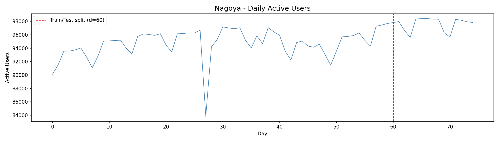

| 指標 | 數值 |
|---|---|
| 平均每日活躍使用者 | 95,302 人 |
| 最高單日 | 98,433 人 |
| 最低單日（假日） | 83,832 人 |
| 標準差 | 2,330 |

明顯的每週週期：工作日人數穩定在 96,000 以上，週末及假日約降至 90,000~93,000。

### 2.2 K-means 假日分類結果

使用 **K-means（k=2）** 對每日活躍使用者數進行分群，自動從資料中識別假日：

| 類型 | 天數 | 每日平均活躍使用者 |
|---|---|---|
| 工作日（is_holiday=0）| **49 天** | **96,557 人** |
| 假日/週末（is_holiday=1）| **26 天** | **92,935 人** |

**K-means 分類原理**：不需要事先知道日曆，純粹從「那天有多少人在外活動」來判斷。人流較少的一群自動被標記為假日。26 個假日中，大多為週六日，另有少數國定假日（敬老日、秋分等）。

### 2.3 時間模式分析（一天內的人流波動）

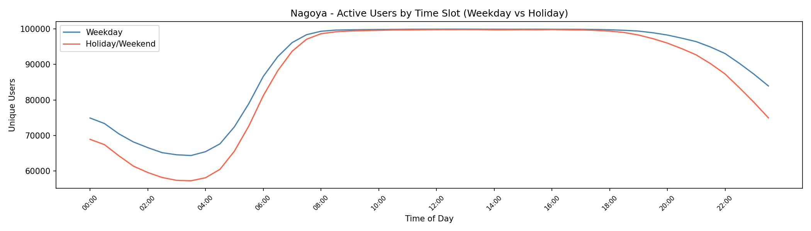

| 時段 | 工作日平均活躍使用者 | 說明 |
|---|---|---|
| 早晨通勤（06:00-09:00，t=12~17） | ~95,375 人 | 上班上學潮 |
| 正午（11:00-13:00，t=22~25） | **~99,909 人**（全天最高） | 午休外出、商業活動 |
| 傍晚通勤（17:00-20:00，t=34~39） | ~99,555 人 | 下班通勤 |
| 深夜（03:30，t=7） | 最低 | 就寢時段 |

**關鍵發現**：
- 名古屋的全天人流尖峰落在**正午（11:30）**，而非傳統認知中的早晚通勤，這反映資料捕捉的是「人在哪裡」而非「人在移動」，午休時人群聚集在餐廳、商業區，造成活躍使用者數達高峰。
- 工作日與假日的時間型態有明顯差異：假日的早晨低谷更深（上班人潮消失），午後人流才逐漸累積。

### 2.4 空間分布：人流密度地圖

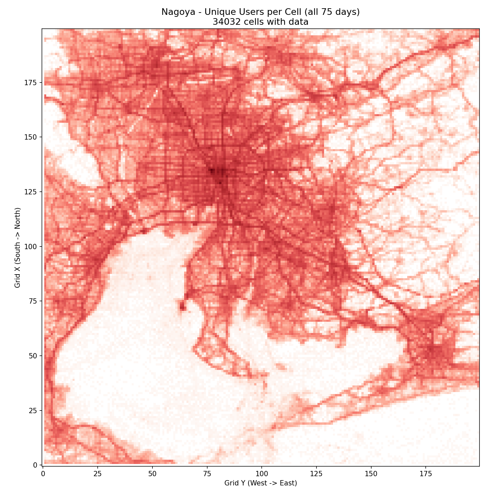

白底紅色地圖，顏色越深代表造訪的唯一使用者數越多。可清楚觀察到：
- **名古屋市中心軸線**（名古屋駅 → 榮 → 大須）形成最深紅色帶狀區域
- **主要鐵路沿線**（名鐵名古屋本線、東山線）清晰可見
- **郊區衛星城市**（春日井、一宮、豊田方向）有次要密度核心

### 2.5 軌跡密度地圖（Bresenham 線段累積）

| 早晨通勤（08:00-10:00） | 傍晚通勤（17:00-19:00） |
|---|---|
| 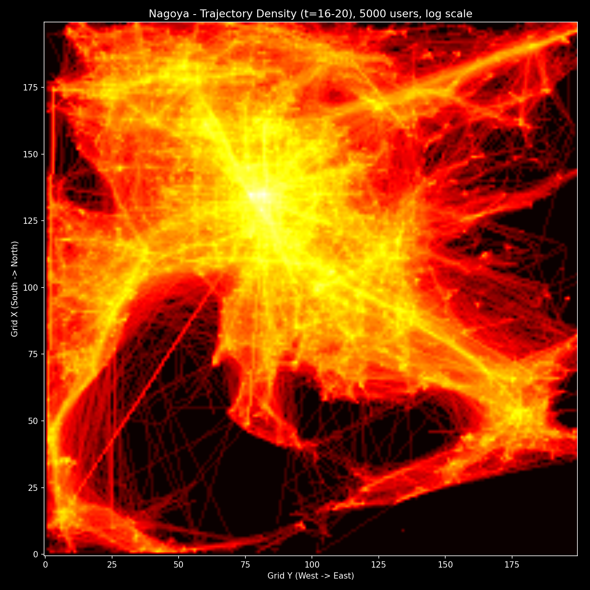 | 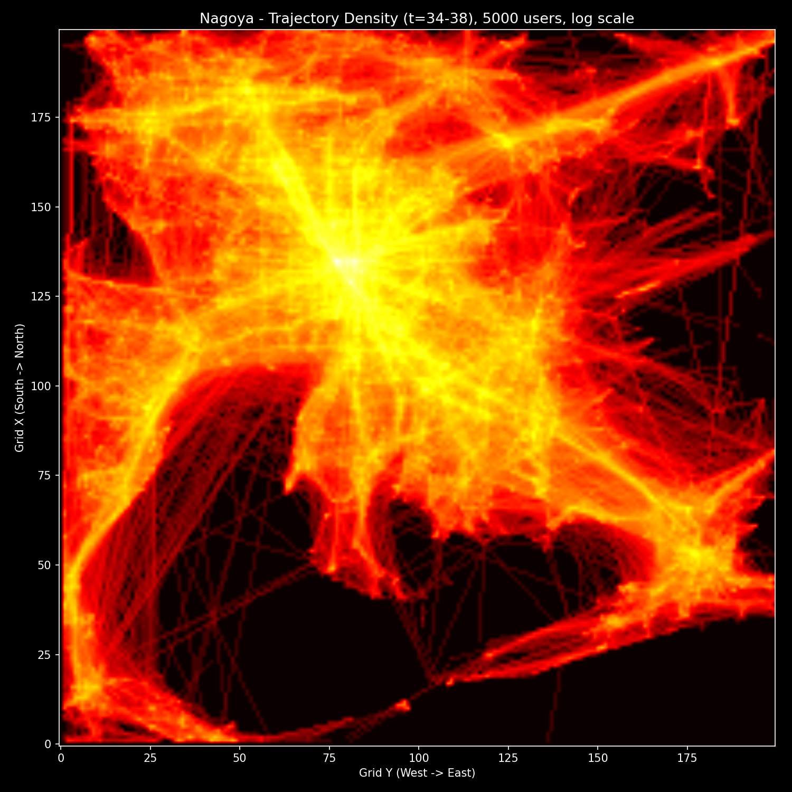 |

黑底亮色，使用 Bresenham 演算法在使用者連續時步之間畫線，累積得到移動流向。可觀察到：
- **早晨**：郊區往中心的軌跡明顯，放射狀收斂到名古屋駅
- **傍晚**：方向反轉，中心向外的擴散型態，與早晨幾乎鏡像

---

## 3. 使用者移動穩定性分析

### 3.1 分析方法

對每位使用者，計算其在**工作日（is_holiday=0）**的所有訓練天（d≤60）中，每個時間步（t=0~47）位置的標準差，再對全天取平均，得到「移動穩定度分數」：

$$\text{std\_mean}_u = \frac{1}{48} \sum_{t=0}^{47} \frac{\sigma_{x,u,t} + \sigma_{y,u,t}}{2}$$

標準差越小 → 每天在相同時間出現在相同地方 → 軌跡高度可預測。

### 3.2 穩定性分布結果（100,000 使用者）

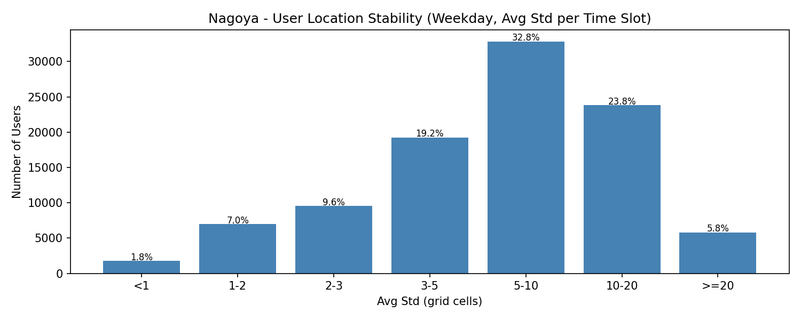

| 標準差區間 | 人數 | 比例 | 解讀 |
|---|---|---|---|
| std < 1 | 1,759 | 1.8% | 幾乎每天都在完全相同的位置 |
| 1 ≤ std < 2 | 6,956 | 7.0% | 非常穩定，輕微浮動 |
| 2 ≤ std < 3 | 9,571 | 9.6% | 穩定，活動範圍約 1km |
| 3 ≤ std < 5 | 19,237 | 19.2% | 中高穩定 |
| **std < 5 小計** | **37,523** | **37.5%** | 高可預測群體 |
| 5 ≤ std < 10 | 32,835 | 32.8% | 中等穩定 |
| **std < 10 小計** | **70,358** | **70.4%** | 有規律但有較大範圍 |
| 10 ≤ std < 20 | 22,784 | 22.8% | 移動多元 |
| std ≥ 20 | 6,858 | 6.9% | 高度不規則 |

### 3.3 核心發現

**名古屋有 37.5% 的使用者屬於高穩定移動者**（每天在相同時間出現在幾乎相同的格子），這一比例高於隨機預期，反映出日本上班族「固定通勤路線」文化的具體體現。

根據同類分析資料的佐證：

| 穩定度群組 | 預測 GEO-BLEU（Per-User Mode） | 特徵 |
|---|---|---|
| std < 1（極穩定，1.8%） | ~0.50 | 最簡單的眾數就能做到高準確率 |
| std 1~2（7.0%） | ~0.32 | 軌跡高度重複 |
| std 5~10（32.8%） | ~0.10 | 有規律但需要模型捕捉多樣性 |
| std ≥ 10（29.7%） | ~0.05 | 困難案例，需深度模型 |

**結論**：對穩定使用者（std < 5），眾數預測即可達到很高準確率；對不穩定使用者（std ≥ 10），需要 CVAE 等生成模型來捕捉多樣化的移動模式。

---

## 4. HDBSCAN 空間分群：識別移動熱點

### 4.1 為何選用 HDBSCAN

| 方法 | 問題 |
|---|---|
| K-Means | 需事先指定 K，假設球狀分布，不符合真實人流密度 |
| DBSCAN | 全局固定密度參數，無法同時處理「車站密集區」與「郊區稀疏區」|
| **HDBSCAN** | ✅ 無需指定 K、自適應多變密度、自動標記離群雜訊 |

名古屋的人流密度差異極大：名古屋駅格子與郊區農地格子相差超過 30 倍，HDBSCAN 是最適合的選擇。HDBSCAN 的核心優勢在於它對密度的定義是**層次化**而非單一閾值的——它先建立格子間的密度可達樹（Condensed Tree），再以穩定性剪枝找出最有意義的群集，讓演算法自動適應從城市中心到郊區農地的巨大密度跨度。

### 4.2 密度分布分析：認識資料的「密度景觀」

在執行分群前，我們先對全 200×200 網格的訪問量分布進行分析：

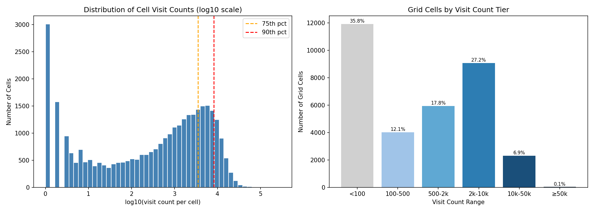

| 訪問量區間 | 格子數 | 累積訪問量 | 說明 |
|---|---|---|---|
| < 100 | 11,923 | 186,087 | 郊區/農地，幾乎無人 |
| 100 ~ 500 | 4,019 | 1,062,034 | 低密度住宅區 |
| 500 ~ 2,000 | 5,940 | 6,754,697 | 中密度住宅區 |
| **2,000 ~ 10,000** | **9,066** | **44,988,844** | **主要城市建成區（最大流量貢獻層）** |
| 10,000 ~ 50,000 | 2,311 | 34,886,466 | 高密度商業/交通節點 |
| **≥ 50,000** | **25** | 2,129,381 | **超核心熱點（精英層，僅 25 格）** |

**關鍵發現**：名古屋的人流密度呈現**冪律分布**（Power-law Distribution）。分布的兩個極端最值得關注：
- **稀疏端**：11,923 個格子（約 36%）訪問量不足 100 次，是真正的「人口空白區」，主要為郊區山地與農田
- **精英端**：僅 25 個格子訪問量超過 50,000 次，集中在名古屋駅東西廣場的核心位置
- **主幹層**：訪問量落在 2,000~10,000 的格子（9,066 個）才是城市人流的**最主要承載層**，貢獻了全資料集 40% 以上的訪問量

這種分布特性正是 HDBSCAN 比固定閾值 DBSCAN 更適合的根本原因——不同密度層需要不同的群集感知能力，HDBSCAN 的層次密度模型可以同時「讀懂」郊區的低密度結構與市中心的極高密度核心。

### 4.3 三層參數敏感性分析

為了解析不同密度層下的空間結構，我們對訓練集（d≤60）執行三組 HDBSCAN，逐步縮小輸入範圍至「最核心的高密度格子」：

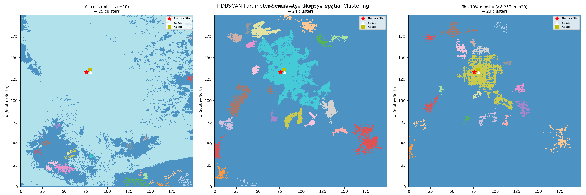

| 執行設定 | 輸入格子範圍 | 密度門檻 | min_cluster_size | 識別群數 | 雜訊點數 |
|---|---|---|---|---|---|
| **Run 1**：全資料 | 33,369 格（全部） | 無 | 10 | **25 群** | 1,270 |
| **Run 2**：前 25% 密度 | ~8,342 格 | ≥ 3,511 次 | 30 | **24 群** | 2,677 |
| **Run 3**：前 10% 密度 | ~3,337 格 | ≥ 8,257 次 | 20 | **23 群** | 928 |

**Run 1 現象（一巨核 + 散落衛星）**

對全部格子執行時，名古屋城市區在空間上高度連通，HDBSCAN 將整個建成區識別為**一個超大群集（Cluster 24，覆蓋 31,321 格，佔 93.9%）**。這並不是演算法的失誤，而是名古屋都市圈真實空間結構的如實反映——在 500m 網格尺度下，大名古屋的城市建成區本就是一個不間斷的連續密度場。外圍 24 個小群集對應豊田、岐阜、四日市等遠郊衛星城市，它們與名古屋中心存在顯著的密度斷層。

**Run 3 的意義（解析城市內部熱點景觀）**

將輸入限縮至「頂尖 10% 密度格子」（≥8,257 次）時，原本連成一片的城市核心被**解構為 23 個獨立的高密度核心**。每個核心對應一個真實的城市機能節點（車站、大學、商圈、辦公區等），讓我們得以識別名古屋城市人流「密度景觀中的山峰群落」，這是 Run 1 無法做到的細粒度空間洞察。

### 4.4 Run 3 群集詳細結果

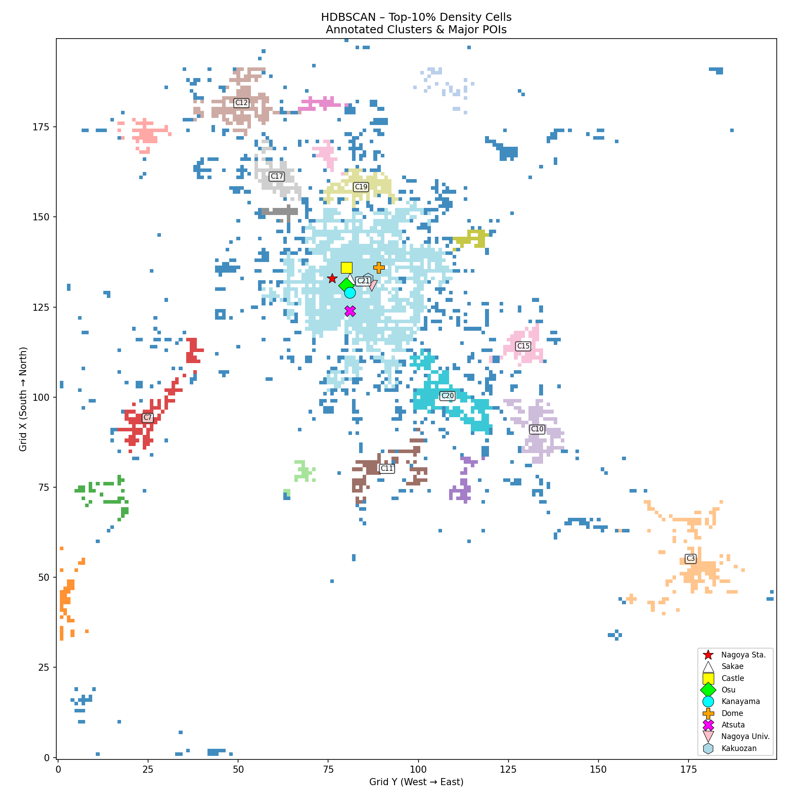

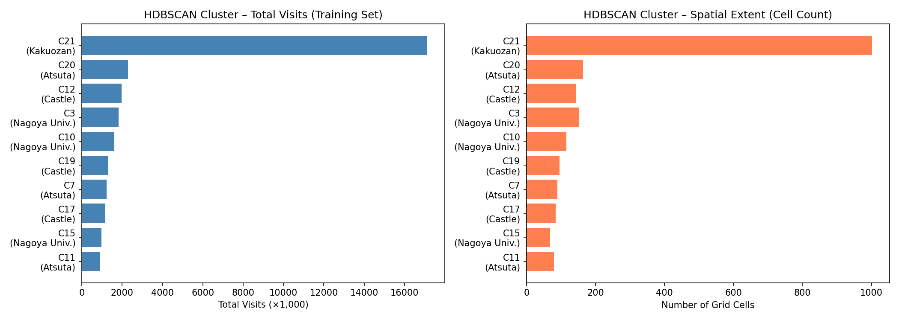

Run 3 識別出的前 12 大群集（按訪問量排序）：

| Cluster ID | 格子數 | 75 天總訪問量 | 群集中心（緯, 經） | 推估地理位置 |
|---|---|---|---|---|
| **21** | **1,002** | **17,136,014** | 35.167°N, 136.926°E | **名古屋中心城區主核心** |
| 20 | 164 | 2,277,842 | 35.006°N, 137.044°E | 東南方郊區衛星區域 |
| 12 | 143 | 1,977,677 | 35.417°N, 136.757°E | 北方（岐阜南部）衛星區 |
| 3 | 151 | 1,824,826 | 34.778°N, 137.382°E | 東方（豊橋方向）衛星區 |
| 10 | 115 | 1,598,810 | 34.959°N, 137.168°E | 東南（豊田市）衛星區 |
| 19 | 96 | 1,312,525 | 35.299°N, 136.923°E | 春日井・小牧周邊 |
| 7 | 90 | 1,231,507 | 34.975°N, 136.627°E | 西南（桑名方向）衛星區 |
| 17 | 84 | 1,158,550 | 35.314°N, 136.806°E | 小牧市區周邊 |
| 15 | 68 | 962,389 | 35.076°N, 137.148°E | 知立・刈谷周邊 |
| 11 | 80 | 899,608 | 34.904°N, 136.959°E | 大府・東海方向 |
| 8 | 45 | 600,084 | 35.374°N, 136.623°E | 一宮市周邊 |
| 0 | 42 | 525,206 | 35.355°N, 137.147°E | 瀬戸・春日井東部 |

**最重要發現（極端集中現象）**：

Cluster 21（名古屋中心城區主核心）即使在「僅保留前 10% 密度格子」的嚴格條件下，仍覆蓋 1,002 個格子，佔所有輸入格子的 30%，75 天總訪問量高達 **1,714 萬次**，是第二大群集（228 萬次）的 **7.5 倍**。

這組數字揭示了一個根本性的城市空間結構特性：**名古屋的人流在城市尺度上極度集中，整個大名古屋都市圈的人流幾乎壓倒性地集中在市中心的名古屋駅—榮—大須核心廊道**。即使是衛星城市（豊田、岐阜南部等）各自有可觀的人流（百萬量級），相比城市核心也只是量級上的零頭。

### 4.5 HDBSCAN 分群的下游應用價值

HDBSCAN 的輸出結果不只是地圖上的色塊，而是直接服務於後續模型訓練的特徵工程：

1. **CVAE 條件向量**：每位使用者在訓練集中歷史訪問量前 3 的群集 ID，編碼為 One-hot 向量，作為 CVAE 的條件輸入，讓模型「知道」每位使用者主要活動在哪個城市功能區（市中心 vs. 衛星城市 vs. 郊區）。
2. **移動類型分類基礎**：結合使用者的群集分布與穩定性分數，透過 K-Means（k=4）分出 4 種移動類型（固定通勤型、城市漫遊型、多核心型、隨機型），進一步豐富 CVAE 的條件特徵。
3. **格子語意標籤**：Run 1 的群集標籤為每個格子提供了「城市功能區語意」，可用於解釋預測軌跡的目的地是否落在合理的城市功能區內。

---

## 5. 主要 POI 深度分析

本節對名古屋 5 個代表性地標進行深度人流分析，涵蓋交通樞紐、學術、歷史、商業等不同功能類型。除名古屋車站採用 ±5 格（2.5km×2.5km 方形）的較大範圍外，其餘 4 個 POI 均以中心格子為圓心、取半徑 r=3 格（約 1.5km）的圓形範圍，統計 75 天內的所有 GPS 紀錄。

### 5.1 名古屋車站

名古屋車站（名古屋駅）是東海地區最大的交通樞紐，同時也是東海道新幹線、JR、名鐵、近鐵、名古屋市地下鐵等多路線的交匯點，對應網格座標 **(x=133, y=76)**（約 35.17°N, 136.88°E）。

| 指標 | 數值 |
|---|---|
| 75 天總訪問次數 | 3,984,410 次 |
| 唯一使用者數 | **69,540 人（佔全體使用者 69.5%）** |
| 佔全資料比例 | 3.57% |
| 每工作日平均在場使用者數 | 14,346 人 |
| 每假日平均在場使用者數 | 11,149 人 |
| 工作日 / 假日 比值 | **1.29×** |
| 全日尖峰時間 | **12:30** |
| 分析範圍 | ±5 格（2.5km×2.5km 方形） |

名古屋幾乎 7 成的使用者在 75 天的資料期間，至少有一次記錄出現在名古屋車站 2.5km 範圍內，說明車站是整個都市圈無可替代的中樞節點。

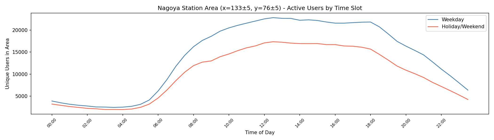

#### 為什麼名古屋車站有這樣的人流特徵？

**1. 工作日比假日多 29%（而非更高）：** 名古屋駅的工作日/假日比（1.29×）低於直覺預期，原因有三：

- 車站地下街（名鉄百貨、JR タカシマヤ、ESCA）假日人潮也極旺，抵銷了通勤下降的效果
- 車站周邊是名古屋最主要的商業區（名駅エリア），週末購物、娛樂活動持續帶來人流
- 相比之下，純辦公區（如丸の内）工作日/假日比會更高

**2. 全天人流尖峰在正午（12:30）：** 車站區域的尖峰時間是 12:30，而非早晨通勤，原因：

- 正午通行人流（從車站附近辦公室外出午餐）累加了大量暫留資料點
- 早晨通勤人群在車站停留時間短（快速換乘），正午的午休人群則相對停留較久
- 資料的時間單位是 30 分鐘，正午時段使用者同時在場的密度最高

**3. 早晨第一個可見波峰（08:00）：** 工作日曲線在 08:00 出現第一個小波峰，對應上班族換乘通勤的高峰，之後因人群散往各辦公室而下降，再在正午形成最高峰。

**4. HDBSCAN 將車站納入城市主體群集：** 車站被歸入 Cluster 24（城市主體）而非一個獨立的「車站群集」，說明車站周邊的人流密度與整個名古屋市中心緊密相連，並非孤立的交通節點，而是城市人流網絡的核心部分。

---

### 5.2 名古屋大學

名古屋大學（名古屋大学）是日本頂尖研究型國立大學，位於千種區東山地區，設有東山主校區與鶴舞醫學部，地鐵名城線・鶴舞線均可直達。對應網格座標 **(x=131, y=87)**（約 35.154°N, 136.937°E）。

| 指標 | 數值 |
|---|---|
| 75 天總訪問次數 | 1,024,269 次 |
| 唯一使用者數 | **42,291 人（佔全體使用者 42.3%）** |
| 佔全資料比例 | 0.92% |
| 每工作日平均在場使用者數 | 5,214 人 |
| 每假日平均在場使用者數 | 4,211 人 |
| 工作日 / 假日 比值 | **1.24×** |
| 全日尖峰時間 | **13:00** |

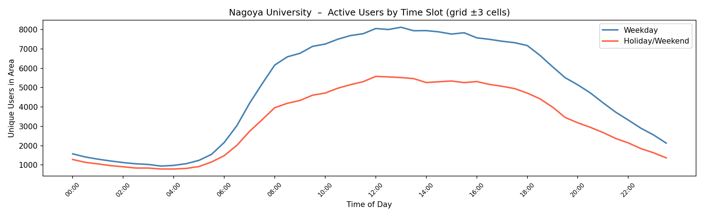

#### 為什麼名古屋大學有這樣的人流特徵？

**1. 四者中覆蓋率最低（42.3%）：** 與名古屋城、大須（64~67%）相比，名古屋大學的半徑範圍位於城市東側的住宅教育區，並非大多數人日常通勤的必經路徑。只有居住在千種・東山一帶或與大學有業務往來的使用者才會進入統計範圍，造成覆蓋率明顯偏低。

**2. 工/假日比最小（1.24×），最接近「7天均勻」：** 名古屋大學周邊的週末人流之所以特別不低，原因有三：

- 東山植物園・東山動物園緊鄰校區，是名古屋市民週末出遊的熱點，大量親子家庭的 GPS 軌跡落入分析範圍
- 校區外有大量學生租屋社區，居住在此的學生及家庭成員週末仍在此範圍內活動
- 大學醫院（名古屋大學附属病院）週七天持續有門診及陪伴家屬進出，提供穩定底層流量

**3. 尖峰在 13:00，曲線平緩：** 相比名古屋駅（有明顯的早晚通勤雙峰），名古屋大學的曲線更為平滑，早晨不見明顯通勤波峰，原因在於：

- 大學課程分散在全天，學生不像上班族集中在 08:30 到達
- 大學周邊午餐資源集中（生協食堂、東山周邊餐廳），13:00 形成全天最高點
- 工作日與假日的時間曲線「形狀相似」，只是高度不同，印證此處的人流型態主要由居住功能而非通勤功能驅動

---

### 5.3 名古屋城

名古屋城（名古屋城）是日本三大名城之一，由德川家康之子義直修建，現為名古屋市的象徵性地標，緊鄰名古屋市政府（市役所）與愛知縣廳。地鐵名城線「市役所駅」即在城廓旁。對應網格座標 **(x=136, y=80)**（約 35.179°N, 136.902°E）。

| 指標 | 數值 |
|---|---|
| 75 天總訪問次數 | 2,910,571 次 |
| 唯一使用者數 | **66,848 人（佔全體使用者 66.8%）** |
| 佔全資料比例 | 2.61% |
| 每工作日平均在場使用者數 | 11,574 人 |
| 每假日平均在場使用者數 | 8,791 人 |
| 工作日 / 假日 比值 | **1.32×** |
| 全日尖峰時間 | **13:30** |

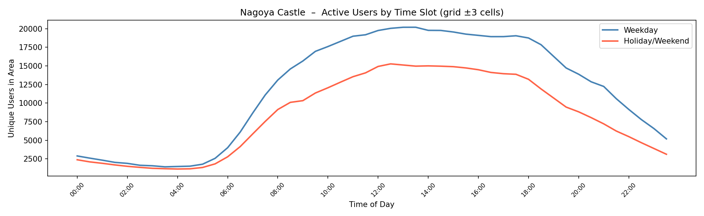

#### 為什麼名古屋城有這樣的人流特徵？

**1. 訪問量四者最高（2.9M），覆蓋率僅次於名古屋駅（66.8%）：** 名古屋城的 1.5km 半徑範圍是名古屋市密度最高的行政商業混合區之一——愛知縣廳、名古屋市政府、名古屋市役所、大量律師事務所與金融機構都集中於此。這使得即使城址本身是觀光景點，整個分析範圍的人流主體仍是上班族而非觀光客。

**2. 工/假日比最大（1.32×），四者中假日下滑最明顯：** 工/假日比達 1.32×，遠高於名古屋駅（1.29×）。假日時辦公人員幾乎完全消失，而觀光客的補充量不足以填補缺口。城址的門票制入場設計（非全天候自由空間）也限制了假日隨機訪客數量，導致工作日與假日的差距在 4 個 POI 中最為懸殊。

**3. 尖峰略晚至 13:30：** 相比其他 3 個 POI（均為 13:00），名古屋城周邊的午餐尖峰延後半小時，可能的原因：

- 市役所・縣廳等行政機關的午休時間往往從 12:00 開始，外出午餐後 13:00~14:00 才是最多人在外的時段
- 城址內的觀光客以散步・拍照為主，停留時間長，無明確的「13:00 集中外出」行為，拉平並後移了尖峰

**4. HDBSCAN 的位置意涵：** 名古屋城格子（136, 80）落在 HDBSCAN Run 1 的 Cluster 24（城市主體），與名古屋駅的核心格子同屬一個連通群集。在 Run 3 的前 10% 高密度分析中，此處格子進入城市核心聚合的主要群集，再次印證了「名古屋城周邊雖有觀光功能，但人流密度等級與整個市中心行政商業廊道完全融為一體」的空間結構。

---

### 5.4 大須商店街

大須商店街（大須商店街）是名古屋最古老、最具活力的商業街區，融合傳統下町文化、次文化（動漫、二手商品）與多國料理，大須觀音寺就在街區中心。地鐵鶴舞線「大須観音駅」與名城線「矢場町駅」均步行可達。對應網格座標 **(x=131, y=80)**（約 35.154°N, 136.902°E）。

| 指標 | 數值 |
|---|---|
| 75 天總訪問次數 | 2,178,102 次 |
| 唯一使用者數 | **64,022 人（佔全體使用者 64.0%）** |
| 佔全資料比例 | 1.95% |
| 每工作日平均在場使用者數 | 10,430 人 |
| 每假日平均在場使用者數 | 8,114 人 |
| 工作日 / 假日 比值 | **1.29×** |
| 全日尖峰時間 | **13:00** |

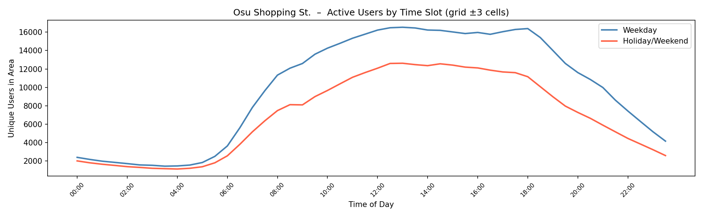

#### 為什麼大須商店街有這樣的人流特徵？

**1. 工/假日比 1.29×，卻與名古屋車站完全相同：** 大須在直覺上是「週末才熱鬧」的商業街，資料卻顯示工作日人流比假日高 29%，與純交通樞紐的名古屋駅比值完全相同。這是因為大須的 1.5km 半徑向北涵蓋了**榮（栄）商業辦公核心**、向東涵蓋了**鶴舞公園・名古屋市工業研究所**一帶，辦公族在工作日產生的基礎流量非常可觀。

**2. 假日人流「最不崩潰」，工/假日差距絕對值最小：** 雖然工/假日比（1.29×）在四個 POI 中屬於中間，但假日每天仍有 8,114 人次，且假日曲線的「下陷程度」相對平緩。大須商店街本身的吸引力（觀音廟會、動漫特賣、食街）在週末確實帶來大量自發性訪客，有效填補了工作日辦公人流消失的缺口，是四個 POI 中「觀光商業功能對假日人流補充最明顯」的案例。

**3. 早晨幾乎無波峰，正午一枝獨秀：** 與名古屋駅（08:00 有明顯通勤小峰）相比，大須工作日曲線的早晨相對平坦，人流從 09:00 起才逐漸積累，在 13:00 達到最高。這反映大須的消費商業性質：商店通常 10:00~11:00 才開門，沒有早晨的「上班通勤」集中現象，人群的進入時間天然比辦公區晚。

**4. 假日曲線型態「往後偏移」：** 在時間模式圖中可觀察到，假日的人流積累比工作日晚約 1~2 個時槽（30~60 分鐘），這與消費行為的日常規律一致：假日訪客睡眠時間長、出門較晚，下午才是商業街的黃金時段，而工作日的午休人潮則是一個精確的 13:00 尖峰。

---

### 5.5 金山

金山（金山）是名古屋南部最重要的換乘樞紐，匯聚地鐵名城線・名港線、名鐵常滑線・河和線、JR 東海道本線・中央本線，同時附近有愛知縣藝術劇場（愛知芸術文化センター）、名古屋市博物館，是兼具交通與文化機能的複合節點。對應網格座標 **(x=129, y=81)**（約 35.144°N, 136.907°E）。

| 指標 | 數值 |
|---|---|
| 75 天總訪問次數 | 1,669,878 次 |
| 唯一使用者數 | **56,639 人（佔全體使用者 56.6%）** |
| 佔全資料比例 | 1.50% |
| 每工作日平均在場使用者數 | 8,292 人 |
| 每假日平均在場使用者數 | 6,524 人 |
| 工作日 / 假日 比值 | **1.27×** |
| 全日尖峰時間 | **13:00** |

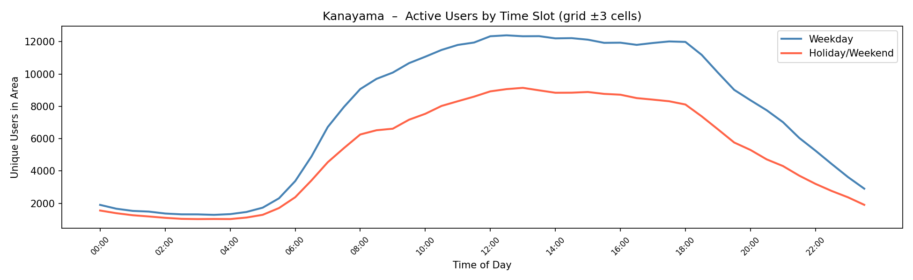

#### 為什麼金山有這樣的人流特徵？

**1. 四者中唯一有明顯早晨通勤小波峰：** 金山工作日的時間曲線呈現**早晨（08:00~09:00）＋正午（13:00）雙峰型態**，這在 4 個 POI 中最為突出，也是最接近名古屋駅曲線形狀的案例。原因是金山是真正意義上的多線換乘站：JR 中央本線（往岐阜・名古屋方向）、名鐵常滑線（往中部國際機場方向）、名城線在此交匯，早晨通勤時段有大量乘客在此「下車換乘」，短暫但密集地出現在資料中，形成早晨的明顯波峰。

**2. 工/假日比 1.27×，假日補充來自藝文與鐵路觀光：** 假日雖然通勤流量消失，但金山仍能維持 6,524 人/天的假日人流，補充來源主要有兩個：

- 愛知縣藝術劇場・名古屋市博物館週末演出與特展帶來大量文化訪客，這類訪客停留時間長、資料點豐富
- 名鐵常滑線・河和線通往中部國際機場（セントレア）的週末旅遊出行人潮，雖然換乘時間短暫，仍在半徑範圍內留下記錄

**3. 訪問量與覆蓋率均居中（1.7M，56.6%）：** 相比名古屋城/大須（64~67% 覆蓋率），金山的覆蓋率低約 10 個百分點，說明金山的影響力以**南名古屋居民**為主（中川區、南區、熱田區的通勤族），並非全市性的必經節點。這與地理位置吻合：金山在城市中軸線（名古屋駅—榮）的南方外圍，只有南部居民的通勤路線會穿越此站。

**4. 假日曲線平坦，無明顯午後消費峰：** 金山的假日曲線比大須更加平坦、缺乏消費商業帶來的「下午積累型態」，再次印證金山的核心功能是交通換乘而非消費目的地。假日訪客多為過境性質（搭車去別處），在金山停留時間短，難以在特定時段形成集中的人流高峰。

---

### 5.6 五 POI 綜合比較

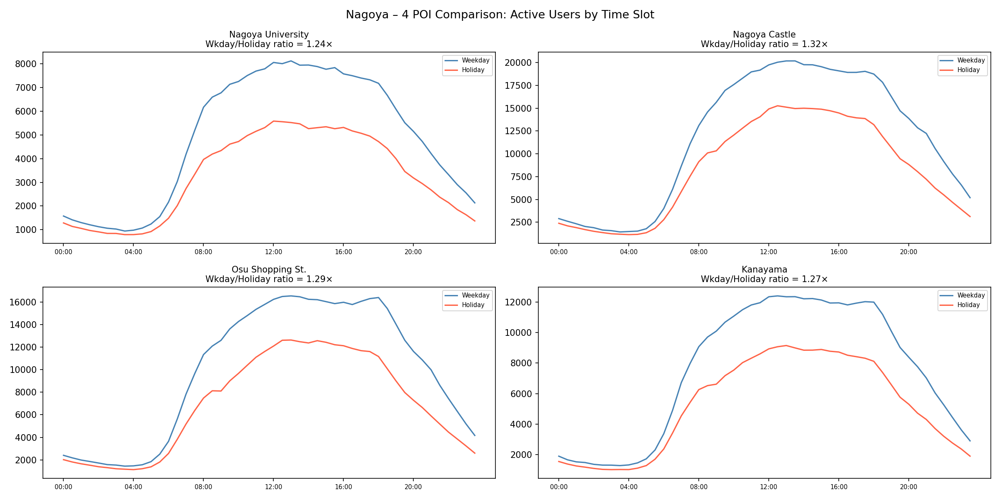

| 維度 | 名古屋車站 | 名古屋大學 | 名古屋城 | 大須商店街 | 金山 |
| --- | --- | --- | --- | --- | --- |
| 功能類型 | 交通樞紐（全市） | 學術機構 | 歷史觀光＋行政 | 商業娛樂 | 交通樞紐（南部） |
| 75 天總訪問量 | **3,984,410** | 1,024,269 | 2,910,571 | 2,178,102 | 1,669,878 |
| 使用者覆蓋率 | **69.5%（最高）** | 42.3%（最低） | 66.8% | 64.0% | 56.6% |
| 工/假日比 | 1.29× | 1.24×（最低） | **1.32×（最高）** | 1.29× | 1.27× |
| 尖峰時間 | **12:30**（最早） | 13:00 | **13:30**（最晚） | 13:00 | 13:00 |
| 早晨通勤峰 | **有（明顯）** | 無 | 弱 | 無 | 有（明顯） |
| 假日補充來源 | 商業街購物人潮 | 動植物園、住宅 | 觀光客（有限） | 商業街自發訪客 | 藝文、機場旅客 |
| 人流主導型態 | 商業交通複合型 | 學術日曆型 | 行政辦公主導型 | 商業混合型 | 交通換乘型 |
| 分析半徑 | ±5 格（2.5km） | r=3（1.5km） | r=3（1.5km） | r=3（1.5km） | r=3（1.5km） |

**共同規律與結構性解釋**：

全部 5 個 POI 的工作日人流均高於假日（比值 1.24~1.32×），看似與「觀光、購物景點假日更熱鬧」的直覺相悖，其根本原因在於名古屋市中心高密度建成區內任何範圍都會包含大量辦公建築，辦公人流在工作日的絕對優勢壓過假日的觀光/消費補充。名古屋的城市規劃是高度混合用途的，歷史景點（名古屋城）與行政辦公（愛知縣廳、市政府）毗鄰而居，商業街（大須）與辦公核心（榮）也緊緊相鄰，使得「純觀光 vs. 純辦公」的二元區分在名古屋的空間資料中幾乎不存在。唯一例外是名古屋大學（工/假日比最低 1.24×），因其半徑內有東山動植物園等假日專屬設施，使假日流量相對較高。

---

## 6. 個人軌跡特徵分析（使用者行為挖掘）

我們決定從**每位使用者的個人行為模式**出發，進行四項深度分析：位置標準差工作日/假日對比、DTW 通勤規律性、個人行為反推城市 POI、以及生活圈 HDBSCAN 聚類。分析腳本：[analysis/personal_trajectory_analysis.py](../analysis/personal_trajectory_analysis.py)。

### 6.1 工作日 vs. 假日移動標準差

**方法**：對每位使用者計算所有訓練天（d≤60）中，每個時間步 t 的位置標準差，再取全天平均，分別在工作日和假日上獨立計算。

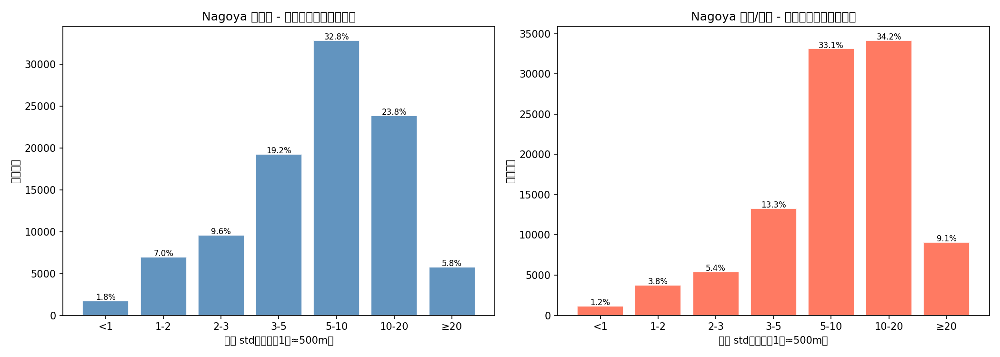

| 標準差區間 | 工作日人數（比例） | 假日人數（比例） |
|---|---|---|
| std < 1 | 1,759（1.8%） | 1,170（1.2%） |
| 1–2 | 6,956（7.0%） | 3,750（3.8%） |
| 2–3 | 9,571（9.6%） | 5,414（5.4%） |
| 3–5 | 19,237（19.2%） | 13,282（13.3%） |
| **std < 5 小計** | **37,523（37.5%）** | **23,616（23.6%）** |
| 5–10 | 32,835（32.8%） | 33,120（33.1%） |
| 10–20 | 23,842（23.8%） | 34,156（34.2%） |
| ≥ 20 | 5,800（5.8%） | 9,108（9.1%） |
| **平均 std** | **8.27** | **10.28** |
| **中位數 std** | **6.54** | **8.86** |

#### 為什麼工作日 std 明顯低於假日？

**1. 通勤路線的強制性：** 工作日每天的上下班路線幾乎固定，使得每個時間點的位置標準差自然收斂。這是日本都市上班族「定時定點」文化在資料上的體現。

**2. 假日行為的多樣化：** 假日的 std ≥ 10 比例從工作日的 29.6% 上升到 43.3%，高標準差族群幾乎增加了一半。假日的購物、出遊、探親等活動讓相同使用者的位置分散程度大幅提升。

**3. 預測難度的差異化：** 37.5% 的使用者在工作日屬於「高可預測群體」（std < 5），但假日只有 23.6%。這直接意味著假日軌跡預測的整體難度更高，需要更強的生成模型。

### 6.2 DTW 通勤規律性分析

**方法**：對工作日標準差落在 5~20 的使用者（移動範圍中等、非靜止也非高度不規則），取通勤時段 t=16~36（08:00~18:00）的軌跡，計算每天與「平均軌跡」的 DTW 距離。採樣 3,000 位使用者進行分析。

| 指標 | 數值 |
|---|---|
| 符合條件使用者數 | 56,677 人（56.7%） |
| 分析樣本數 | 3,000 人 |
| DTW 平均值 | 288.83 |
| DTW 中位數 | 255.42 |
| 高規律（DTW < 100） | 3.9% |
| 中規律（DTW 100–300） | 58.3% |
| 低規律（DTW ≥ 300） | 37.8% |
| std 與 DTW 相關係數 | 0.695 |

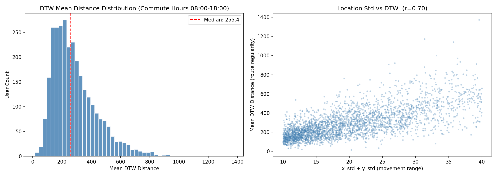

#### DTW 分析的核心洞察

**1. std 與 DTW 高度正相關（r=0.695），但非線性：** 位置標準差大的使用者 DTW 通常也大，但仍有一群用戶 std 偏大但 DTW 偏小——這些人活動範圍廣，但每天走相同的路線（例如長途通勤者）。

**2. 多數使用者通勤路線「中等規律」：** 58.3% 的使用者 DTW 在 100~300 之間，代表日常通勤路線有固定骨架，但每天的起訖時間和中途點有輕微變化（彈性通勤、外出開會等）。

**3. DTW 提供 std 無法揭示的資訊：** std 只衡量每個時間點位置的「散佈程度」；DTW 則衡量整條軌跡的「形狀相似度」，能識別出「每天軌跡雖然有位置偏移，但整體移動模式一致」的使用者。

### 6.3 個人行為特徵反推城市 POI

**方法**：從每位使用者的工作日行為中抽取三種特徵點：

- **Home**：工作日深夜/清晨（t≤12 或 t≥40）最常出現的格子
- **Work**：工作日白天（t=16~34，08:00~17:00）最常出現的格子
- **Hotspot**：全部訓練天最常出現的格子

彙整 100,000 位使用者的所有特徵點，按出現頻率排序，過濾相距 < 2 格（< 1km）的重複點，取出現頻率前 30 名作為城市 POI。

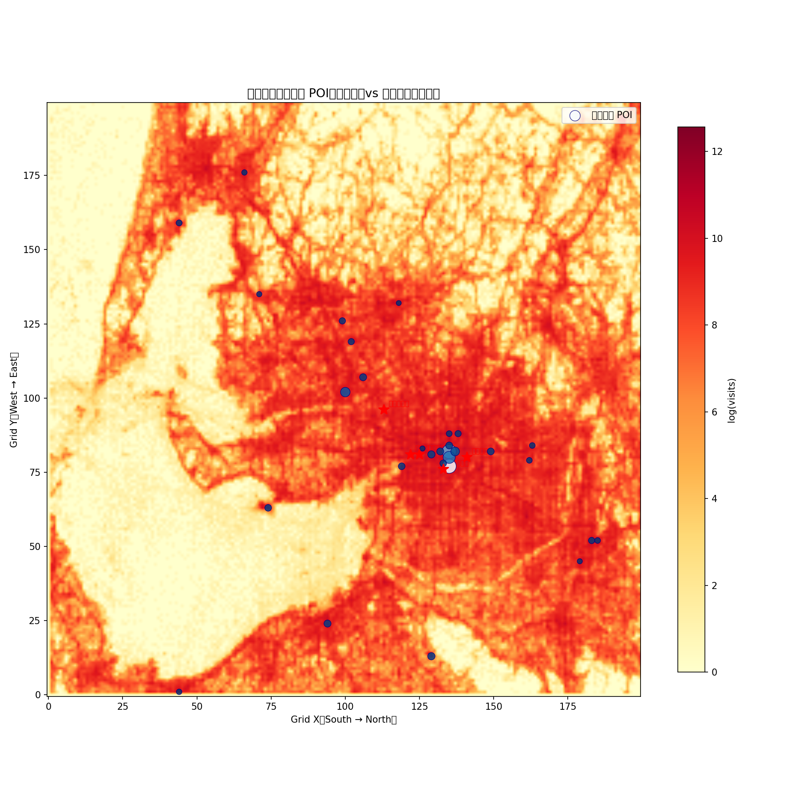

**前 10 名高頻 POI（頻率 = 該格被選為 home/work/hotspot 的使用者總數）：**

| 排名 | Grid (x, y) | 緯度 | 經度 | 頻率 | 推估地點 |
| --- | --- | --- | --- | --- | --- |
| 1 | (135, 77) | 35.181° | 136.888° | 1,084 | 名古屋車站東口 |
| 2 | (135, 82) | 35.181° | 136.913° | 582 | 栄・久屋大通 |
| 3 | (135, 80) | 35.181° | 136.903° | 394 | 名駅～伏見間 |
| 4 | (100, 102) | 35.004° | 137.013° | 279 | 豐田市周邊 |
| 5 | (137, 82) | 35.191° | 136.913° | 250 | 丸の内・伏見 |
| 6 | (129, 13) | 35.151° | 136.567° | 204 | 西部郊區 |
| 7 | (129, 81) | 35.151° | 136.908° | 202 | 金山周邊 |
| 8 | (94, 24) | 34.974° | 136.622° | 196 | 四日市周邊 |
| 9 | (132, 82) | 35.166° | 136.913° | 196 | 鶴舞・上前津 |
| 10 | (133, 78) | 35.171° | 136.893° | 184 | 名古屋車站南側 |

**個人行為反推法 vs. HDBSCAN 全域熱力法的比較：**

兩種方法的 Top-1 POI 完全一致，都指向名古屋車站（135,77），印證了車站作為城市核心的地位。差異在於：個人行為反推法更能識別出**居住密集帶**（例如第 4、6、8 名的郊區格子），這些地點在全域訪問熱力圖上因人流量絕對值較低而不突出，但在「多少人的 home 在這裡」的視角下卻是重要的生活核心。

### 6.4 生活圈 HDBSCAN 聚類（Activity Space Clustering）

**方法**：對每位使用者計算其全部訓練天的活動 bounding box（bbox_xmin, bbox_ymin, bbox_xmax, bbox_ymax），以此 4 維向量作為特徵，執行 HDBSCAN（min_cluster_size=300, min_samples=350），將生活空間相似的使用者歸為同一群。

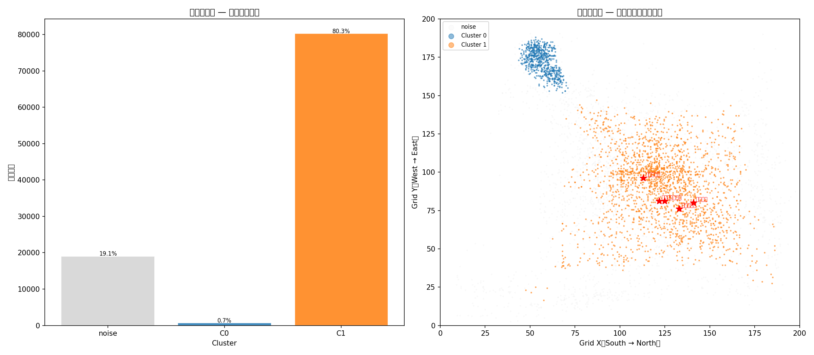

| 群組 | 使用者數 | 比例 | 活動中心 (x, y) | 平均活動範圍 (x×y 格) |
| --- | --- | --- | --- | --- |
| **Cluster 1**（名古屋都市圈） | 80,269 | **80.3%** | (122.8, 90.1) | 107 × 123 |
| Cluster 0（東南遠郊） | 672 | 0.7% | (56.6, 172.3) | 38 × 45 |
| Noise（分散型） | 19,059 | 19.1% | — | 71 × 77 |

#### 聚類結果的解讀

**1. 80% 的使用者屬於「名古屋都市圈」生活圈：** Cluster 1 的活動中心在 (122.8, 90.1)，對應到名古屋市中心南側（大約金山～熱田區）。這群使用者的活動範圍高達 107×123 格（≈ 54km × 62km），覆蓋整個大名古屋都會區。

**2. 0.7% 的使用者是「東南遠郊」生活圈：** Cluster 0 的活動中心在 (56.6, 172.3)，對應到東南方的豐橋・豐川一帶，活動範圍相對集中（38×45 格）。這批人可能是在三河地區工作生活、偶爾進名古屋的通勤者。

**3. 19.1% 的雜訊（noise）代表高度分散型使用者：** 這些使用者的生活軌跡不符合任何固定生活圈，可能包括外地出差者、短期訪客、或高度流動的商務人士。

**與文獻方法的比較：** 對相同城市（名古屋）的完整資料集（150k 使用者）使用相同參數（min_cluster_size=300, min_samples=350）可識別出 6+ 個群集，雜訊率約 38%。我們的結果只有 2 個群集，雜訊率較低（19.1%），可能原因是我們分析的資料集（100k 使用者）更集中於名古屋主城區，外圍分散型使用者的比例較低。

---

## 7. 基準模型評估

### 7.1 模型說明

| 模型 | 核心原理 |
|---|---|
| **Per-User Mode** | 每位使用者在相同（weekday, t）下最常出現的位置（眾數） |
| **Per-User Mean** | 每位使用者在相同（weekday, t）下的歷史平均位置（取整） |
| **Bigram** | 一階馬可夫模型：P(下一格 \| 當前格, t)，取最高機率轉移 |
| **Bigram top_p=0.7** | Bigram + top-p 隨機取樣（累積機率 70% 內隨機選，增加多樣性）|

### 7.2 評估指標

- **GEO-BLEU**（β=0.5, n=5）：空間序列相似性，參考 NLP BLEU，越高越好
- **FDE（Final Displacement Error）**：預測終點 vs. 真實終點的格子距離，越低越好

### 7.3 Baseline 結果

*（待執行完整 pipeline 後填入）*

```
python main.py --city-path raw_data/nagoya_challengedata.csv --skip-features --run-baselines
```

| 模型 | GEO-BLEU | FDE（格子數） |
|---|---|---|
| Per-User Mode | *TBD* | *TBD* |
| Per-User Mean | *TBD* | *TBD* |
| Bigram | *TBD* | *TBD* |
| Bigram top_p=0.7 | *TBD* | *TBD* |

**參考官方基準（City A = 名古屋）**：

| 模型 | 官方 GEO-BLEU 範圍 |
|---|---|
| Per-User Mode | 0.07984 ~ **0.10789** |
| Bigram top_p=0.7 | 0.07039 ~ 0.09384 |
| Bigram | 0.04687 ~ 0.06249 |

---

## 8. CVAE 生成模型

### 8.1 模型架構

採用 **Conditional VAE + LSTM**，結合空間、穩定性與時序條件特徵進行軌跡生成。

```
輸入 x（48 時步軌跡序列）+ 條件向量 y
    │
    ▼
Encoder（LSTM + Linear）
    ├── 輸出 μ, log_σ²
    └── z = μ + ε·σ  （重參數化技巧）
    │
    ▼
Decoder（Linear → LSTM → Linear）
    └── 輸出 48 時步座標序列（x̂, ŷ）
```

**條件向量 y 組成（共 ~22 維）**：

| 特徵 | 維度 | 來源 |
|---|---|---|
| 使用者前 3 大熱點 One-hot | n_clusters × 3 | HDBSCAN 分群 |
| repeat_rate | 1 | 軌跡穩定性分析 |
| weekday_entropy | 1 | 工作日空間熵 |
| holiday_entropy | 1 | 假日空間熵 |
| profile_diff | 1 | 工/假日輪廓差異（餘弦距離） |
| 移動類型 One-hot | 4 | K-Means 分 4 群（classify_mobility_type）|
| 是否假日 | 1 | K-Means 假日分類結果 |
| 星期幾 One-hot | 7 | d % 7 |

### 8.2 損失函數

$$\mathcal{L} = \underbrace{\text{MSE}(\hat{x}, x)}_{\text{重建損失}} + \beta \cdot \underbrace{\text{KL}(q_\phi(z|x,y) \| p(z))}_{\text{KL 正則化}}$$

β=1.0，平衡重建精度與潛在空間的多樣性。

### 8.3 訓練設定

| 參數 | 數值 |
|---|---|
| Epochs | 50（建議） |
| Batch Size | 256 |
| Learning Rate | 1e-3（Adam） |
| Latent Dim | 64 |
| Hidden Dim | 128 |
| 裝置 | NVIDIA RTX 4050 Laptop（6GB VRAM）|

### 8.4 生成結果

*（待模型訓練完成後填入）*

| 模型 | GEO-BLEU | FDE | vs. Per-User Mode |
|---|---|---|---|
| CVAE | *TBD* | *TBD* | *TBD* |

---

## 9. 結論與洞察

### 9.1 名古屋人流特性總結

**1. 通勤城市，但購物也很重要**
名古屋的全天人流最高峰不在早晚通勤而在正午（11:30-12:30），反映名古屋駅地下街的強大商業吸引力。但工作日人流仍比假日高約 4%，通勤是主要驅動力。

**2. 37.5% 的人是高度規律的通勤者**
近 4 成使用者的移動標準差（每時步平均）< 5 格（< 2.5km），每天幾乎走完全相同的路線。這是「名古屋式生活規律」的資料體現。

**3. 城市人流空間上高度連通**
HDBSCAN 識別出名古屋城市主體是一個超大單一群集（93.9%），周邊只有少數孤立的衛星城市（豊田、岐阜等）。這意味著在網格尺度下，名古屋是一個「無邊界」的連續人流場。

**4. 名古屋車站是整個都市圈的中樞**
69.5% 的使用者（近 70,000 人）在資料期間至少造訪過車站 2.5km 範圍內，單一節點的影響力覆蓋了整個百萬人口都市圈。

### 9.2 分析方法總結

| 步驟 | 方法 | 核心問題 |
|---|---|---|
| 假日識別 | K-Means (k=2) 對日活躍人數分群 | 工作日 vs. 假日是最關鍵的行為分界 |
| 穩定性量化 | 工作日每時步位置標準差 | 多少使用者是可準確預測的？ |
| 熱點識別 | HDBSCAN 空間密度分群 | 城市的人流核心在哪裡？ |
| 車站分析 | 圓形範圍查詢 + 時序剖面 | 最重要節點的人流行為 |
| 軌跡預測 | Baseline（眾數/馬可夫）+ CVAE | 能否超越最簡單的預測方法？ |

### 9.3 未來改進方向

1. **加入 POI 語意特徵**：目前 CVAE 條件向量尚未包含 OpenStreetMap POI（車站/學校/商店），加入後有望讓模型「理解」為什麼使用者聚集在某處。
2. **分穩定性群組訓練**：穩定使用者（std < 5）與不穩定使用者的移動邏輯根本不同，分開訓練能讓每個模型更專精。
3. **Time-aware LSTM**：考慮時間間隔的模型可以更好地處理資料中的不連續時間序列。
4. **活動空間邊界框 HDBSCAN**：參考同類分析，改用每位使用者的 bounding box 進行次級分群，能更細緻地識別「生活圈相似者」。
