# 名古屋城市人流特性分析與軌跡預測

**課程**：資料探勘 / **組別**：第 3 組  
**成員**：高健壹、陳致瑋、劉子銘、黃楷奇、黃俊傑、陳旭霖  
**資料集**：Nagoya City Mobility Trajectories（LY Corporation，ACM SIGSPATIAL GIS Cup 2025）  
**分析日期**：2026-06

---

## 摘要

本研究以日本名古屋市大規模去識別化智慧型手機移動軌跡資料為基礎（111,535,175 筆記錄、100,000 名使用者、75 天），從資料探勘與深度學習兩個維度分析城市人流特性並預測個人移動軌跡。

分析流程分為兩階段：
- **特徵探勘**：透過 K-Means 假日識別、HDBSCAN 空間密度分群、5 個代表性 POI 時序分析、以及個人軌跡穩定性與 DTW 規律性量化，系統性地描繪名古屋的城市人流結構。
- **預測模型**：以四種 Baseline（Per-User Mode/Mean、Bigram、Bigram top_p=0.7）確立本地評估基準（最高 GEO-BLEU = 0.16950），並以 Conditional VAE + LSTM 作為深度生成模型，驗證分析特徵對預測的整合可行性。

核心發現：名古屋 37.5% 的使用者屬高度規律通勤者；城市人流呈現冪律分布，整個都市圈 93.9% 的建成區屬同一連通群集；名古屋車站覆蓋 69.5% 的使用者，是全市無可替代的交通核心。

---

## 目錄

1. [研究背景與問題定義](#1-研究背景與問題定義)
2. [資料集概述](#2-資料集概述)
3. [探索性資料分析](#3-探索性資料分析)
4. [使用者移動穩定性分析](#4-使用者移動穩定性分析)
5. [HDBSCAN 空間分群：識別移動熱點](#5-hdbscan-空間分群識別移動熱點)
6. [主要 POI 深度分析](#6-主要-poi-深度分析)
7. [個人軌跡特徵分析](#7-個人軌跡特徵分析)
8. [模型方法](#8-模型方法)
9. [實驗結果與評估](#9-實驗結果與評估)
10. [結論](#10-結論)

---

## 1. 研究背景與問題定義

### 1.1 研究動機

日本三大都市圈集中了全國 51.8% 的人口，極端的都市化帶來三大核心挑戰：通勤尖峰交通癱瘓、突發事件疏散困難（首都直下型地震預估將產生約 517 萬名歸宅困難者），以及觀光熱點乘載超載（Overtourism）。大規模移動軌跡資料為解決這些問題提供了前所未有的機會。

本研究聚焦名古屋市，以 ACM SIGSPATIAL GIS Cup 2025 的競賽資料為基礎，結合資料探勘技術與深度生成模型，系統性地分析城市人流的時空規律。

### 1.2 研究問題

| 問題 | 說明 | 對應章節 |
|---|---|---|
| **Q1**：城市移動熱點如何分布？ | 在無預設分群前提下識別城市移動聚集區域 | 第 5 章 |
| **Q2**：不同地點的語意角色為何？ | 車站、學校、商店街等地點的工/假日人流特性差異 | 第 6、7 章 |
| **Q3**：個人移動軌跡是否可被預測？ | 整合空間、語意與時序特徵建立預測/生成模型 | 第 8、9 章 |

---

## 2. 資料集概述

### 2.1 基本資訊

| 欄位 | 數值 |
|---|---|
| 總資料筆數 | 111,535,175 筆 |
| 總使用者數 | 100,000 人 |
| 資料天數 | 75 天（d=1~75） |
| 訓練集（d≤60） | 90,007,509 筆 |
| 測試集（d>60） | 21,527,666 筆 |
| 空間解析度 | 200×200 格，每格約 500m×500m |
| 時間解析度 | 每天 48 個時段，每段 30 分鐘 |

資料來源為 LY Corporation（前 Yahoo Japan）提供的去識別化智慧型手機位置記錄，時間範圍推估涵蓋 2019 年秋季約三個月。原始資料共 ~150,000 名使用者，其中約 50,000 名使用者的 d=61~75 資料為 x=y=999 佔位行（待預測），已在讀取階段過濾；實際分析對象為具備完整 75 天軌跡的 **100,000 人**。

### 2.2 空間覆蓋率

全部 200×200 = 40,000 個網格中，有資料記錄的格子共 **34,032 個（85.1%）**（涵蓋全部 75 天）。名古屋都市區幾乎佔滿整個地圖，僅南部海岸、東部山區等地人煙稀少。

> **格子數說明**：後續章節出現三個不同的格子數——34,032（全75天）、33,369（僅訓練集 d≤60 出現的格子，HDBSCAN Run 1 輸入）、33,284（密度表 6 個區間加總，訓練集中滿足最低密度門檻後進入統計的格子）——三者差異均由資料時間範圍或統計門檻差異造成，並非計算錯誤。

### 2.3 訪問量最高的前 10 格

| 排名 | Grid (x, y) | 緯度 | 經度 | 總訪問次數 | 推估地點 |
|---|---|---|---|---|---|
| 1 | (135, 77) | 35.181° | 136.888° | 359,963 | 名古屋駅東口周邊 |
| 2 | (135, 82) | 35.181° | 136.913° | 196,083 | 榮・久屋大通周邊 |
| 3 | (134, 77) | 35.176° | 136.888° | 176,167 | 名古屋駅南側 |
| 4 | (129, 81) | 35.151° | 136.908° | 151,722 | 金山周邊 |
| 5 | (135, 78) | 35.181° | 136.893° | 140,375 | 名駅～伏見間 |
| 6 | (134, 82) | 35.176° | 136.913° | 119,788 | 栄・矢場町周邊 |
| 7 | (135, 81) | 35.181° | 136.908° | 108,035 | 伏見駅周邊 |
| 8 | (134, 80) | 35.176° | 136.903° | 100,824 | 丸の内周邊 |
| 9 | (135, 80) | 35.181° | 136.903° | 100,232 | 国際センター周邊 |
| 10 | (135, 76) | 35.181° | 136.883° | 96,173 | 名古屋駅西口（太閤通）周邊 |

前 10 名幾乎全部集中在「名古屋駅 ↔ 栄」這條城市中軸線上，與真實地圖高度吻合，初步確認座標系統的正確性。

---

## 3. 探索性資料分析

### 3.1 假日識別：K-Means 分群

在不借助日曆資訊的前提下，以 **K-Means（k=2）** 對每日活躍使用者數進行分群，自動從人流資料中識別假日。

| 類型 | 天數 | 每日平均活躍使用者 |
|---|---|---|
| 工作日（is_holiday=0）| **49 天** | **96,557 人** |
| 假日/週末（is_holiday=1）| **26 天** | **92,935 人** |

K-Means 的分類原理是純粹以「那天有多少人在外活動」來判斷——人流較少的一群自動被標記為假日。26 個假日中，大多為週六日，另有少數國定假日（敬老日、秋分等）。這個無監督分類結果與真實日本假日曆高度吻合，是後續所有工/假日分析的基礎。

### 3.2 每日活躍使用者趨勢

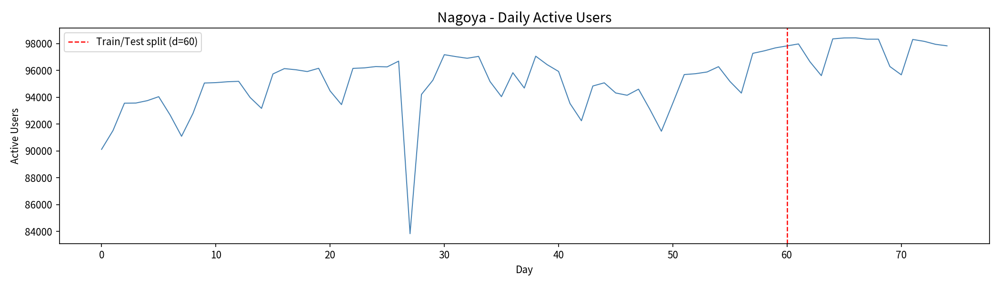

| 指標 | 數值 |
|---|---|
| 平均每日活躍使用者 | 95,302 人 |
| 最高單日 | 98,433 人 |
| 最低單日（假日） | 83,832 人 |
| 標準差 | 2,330 |

時序圖呈現明顯的每週週期：工作日人數穩定在 96,000 以上，週末及假日降至 90,000~93,000。

### 3.3 一天內的人流波動

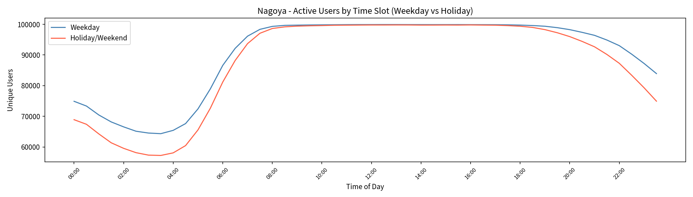

| 時段 | 工作日平均活躍使用者 | 說明 |
|---|---|---|
| 早晨通勤（06:00-09:00，t=12~17） | ~95,375 人 | 上班上學潮 |
| 正午（11:00-13:00，t=22~25） | **~99,909 人（全天最高）** | 午休外出、商業活動 |
| 傍晚通勤（17:00-20:00，t=34~39） | ~99,555 人 | 下班通勤 |
| 深夜（03:30，t=7） | 最低 | 就寢時段 |

**關鍵發現**：名古屋的全天人流尖峰落在**正午（11:30）**，而非傳統認知中的早晚通勤。這反映資料捕捉的是「人在哪裡」而非「人在移動」——午休時人群聚集在餐廳、商業區，造成活躍使用者數達高峰。工作日與假日的時間型態有明顯差異：假日的早晨低谷更深（上班人潮消失），午後人流才逐漸累積。

### 3.4 空間分布：人流密度地圖

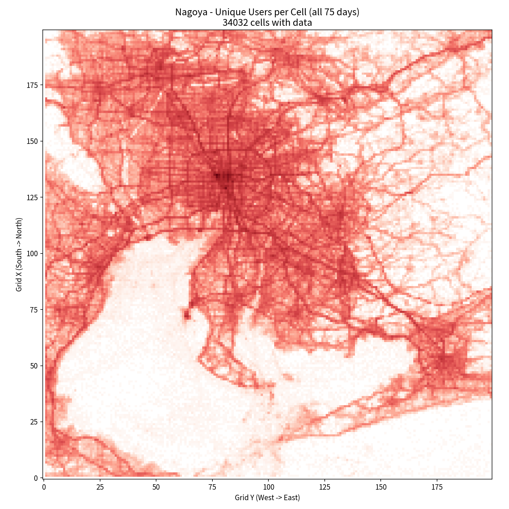

白底紅色地圖，顏色越深代表造訪的唯一使用者數越多。可清楚觀察到：
- **名古屋市中心軸線**（名古屋駅 → 榮 → 大須）形成最深紅色帶狀區域
- **主要鐵路沿線**（名鐵名古屋本線、東山線）清晰可見
- **郊區衛星城市**（春日井、一宮、豊田方向）有次要密度核心

### 3.5 軌跡密度地圖（Bresenham 線段累積）

| 早晨通勤（08:00-10:00） | 傍晚通勤（17:00-19:00） |
|---|---|
| 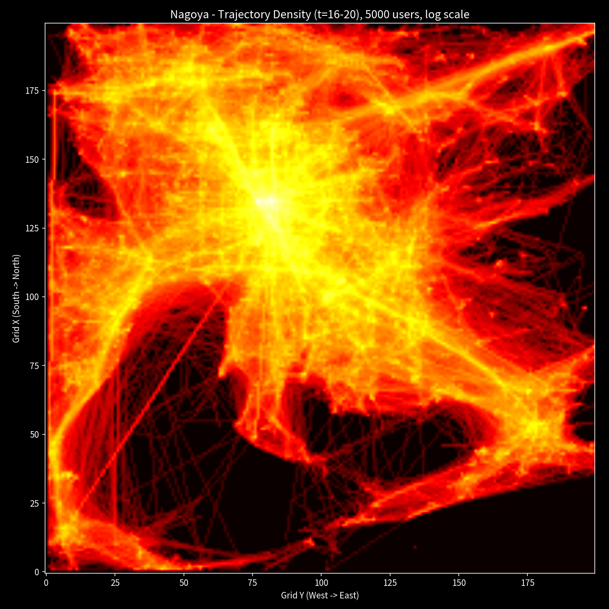 | 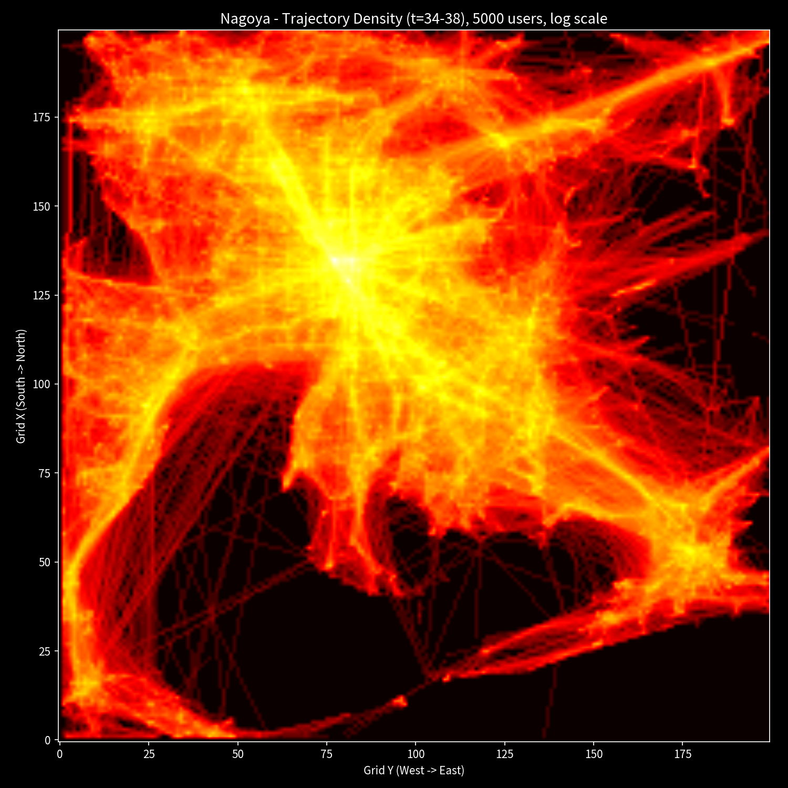 |

黑底亮色，使用 Bresenham 演算法在使用者連續時步之間畫線，累積得到移動流向：
- **早晨**：郊區往中心的軌跡明顯，放射狀收斂到名古屋駅
- **傍晚**：方向反轉，中心向外的擴散型態，與早晨幾乎鏡像

---

## 4. 使用者移動穩定性分析

### 4.1 分析方法

對每位使用者，計算其在**工作日（is_holiday=0）**的所有訓練天（d≤60）中，每個時間步（t=0~47）位置的標準差，再對全天取平均，得到「移動穩定度分數」：

$$\text{std\_mean}_u = \frac{1}{48} \sum_{t=0}^{47} \frac{\sigma_{x,u,t} + \sigma_{y,u,t}}{2}$$

標準差越小代表每天在相同時間出現在相同地方，軌跡高度可預測。

### 4.2 穩定性分布結果（100,000 使用者）

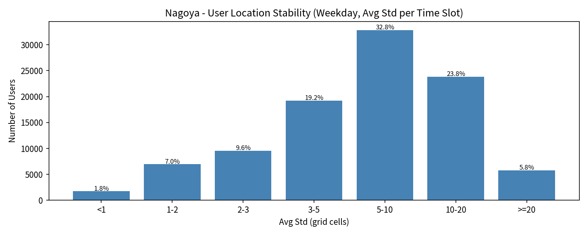

| 標準差區間 | 人數 | 比例 | 解讀 |
|---|---|---|---|
| std < 1 | 1,759 | 1.8% | 幾乎每天都在完全相同的位置 |
| 1 ≤ std < 2 | 6,956 | 7.0% | 非常穩定，輕微浮動 |
| 2 ≤ std < 3 | 9,571 | 9.6% | 穩定，活動範圍約 1km |
| 3 ≤ std < 5 | 19,237 | 19.2% | 中高穩定 |
| **std < 5 小計** | **37,523** | **37.5%** | **高可預測群體** |
| 5 ≤ std < 10 | 32,835 | 32.8% | 中等穩定 |
| **std < 10 小計** | **70,358** | **70.4%** | 有規律但有較大範圍 |
| 10 ≤ std < 20 | 23,842 | 23.8% | 移動多元 |
| std ≥ 20 | 5,800 | 5.8% | 高度不規則 |

### 4.3 核心發現

**名古屋有 37.5% 的使用者屬於高穩定移動者**（每天在相同時間出現在幾乎相同的格子），反映日本上班族「固定通勤路線」文化在資料上的具體體現。

穩定性分析對預測模型的意涵：
- 對高穩定使用者（std < 5），最簡單的眾數預測即可達到高準確率
- 對低穩定使用者（std ≥ 10），需要 CVAE 等生成模型捕捉多樣化的移動模式
- 此差異性是後續 CVAE 條件向量設計的核心依據

---

## 5. HDBSCAN 空間分群：識別移動熱點

### 5.1 方法選擇依據

| 方法 | 問題 |
|---|---|
| K-Means | 需事先指定 K，假設球狀分布，不符合真實人流密度 |
| DBSCAN | 全局固定密度參數，無法同時處理「車站密集區」與「郊區稀疏區」|
| **HDBSCAN** | ✅ 無需指定 K、自適應多變密度、自動標記離群雜訊 |

名古屋的人流密度差異極大：名古屋駅格子與郊區農地格子的**造訪量**相差超過 30 倍（第 2.3 節）。HDBSCAN 的核心優勢在於其**層次化密度定義**——先建立格子間的密度可達樹（Condensed Tree），再以穩定性（Excess of Mass）剪枝找出最有意義的群集，讓演算法自動適應從城市中心到郊區農地的巨大密度跨度。第 5.3 節將以實際執行結果，實證這個理論優勢是否成立。

#### 5.1.1 演算法原理：HDBSCAN「看到」的密度，與我們直覺的密度是兩回事

HDBSCAN 判斷群集的依據是 **Mutual Reachability Distance**：每個點的「核心距離」（core distance，定義為與其第 k 個最近鄰的距離）越小，代表該點所在區域的**空間點密度**越高；演算法再以核心距離重新定義點對點的可達距離，建構最小生成樹與密度可達樹（Condensed Tree），最後以 Excess-of-Mass 在樹上選出最穩定的分支作為群集。

我們對訓練集 33,284 個有記錄格子，實際計算每格的 5-近鄰核心距離，原本預期「市中心格子」與「郊區格子」的核心距離會有顯著差異（畢竟兩者的造訪量差距高達 30 倍）。但結果出乎意料：

| 比較對象 | 核心距離（5-NN，格） |
|---|---|
| 名古屋駅格子 (133, 76)（造訪量 17,672 次） | **1.414**（= √2） |
| 造訪量最低 25%「郊區」格子（中位數） | **1.414**（= √2） |
| 比值 | **1.0 倍（完全相同）** |
| 全體格子核心距離的 10th ~ 90th 百分位數 | 同樣全部是 **1.414** |
| 99th 百分位數（最孤立的 1% 格子） | 2.828（= 2√2） |

**這個「反直覺」結果揭示了一個關鍵的方法論真相**：HDBSCAN 在這裡是對「有記錄格子的 (x, y) 座標點集」做空間點群聚，它感知的「密度」是「佔用格子在地圖上排列得多緊密」（空間點密度），而**不是**「該格子被造訪了幾次」（造訪量密度）。名古屋的建成區佔滿了地圖 85.1%（34,032/40,000 格，第 2.2 節），幾乎所有格子（無論是市中心還是一般郊區住宅區）都被其他佔用格子緊密環繞——90% 的格子核心距離都恰好等於棋盤格上「對角相鄰」的最小可能距離 √2，僅最孤立的 1% 格子才略高。換言之，**僅憑座標，HDBSCAN 完全看不到名古屋駅與郊區之間高達 30 倍的造訪量落差**。

這正是本研究採用「三層 HDBSCAN」設計（5.4 節）的根本原因：要讓 HDBSCAN「看見」造訪量的差異，唯一的辦法是**先用造訪量門檻篩選輸入點集**，把「造訪量密度」轉譯成它聽得懂的語言——「空間點密度」。Run 1（不篩選）下，幾乎所有佔用格子彼此緊鄰，HDBSCAN 自然把整個建成區判為一個巨型連續群集；而 Run 3（僅保留前 10% 高造訪量格子）先移除了連結各熱點的「中密度過渡帶」，讓殘留的熱點格子在空間上彼此疏離、核心距離產生有意義的差異，HDBSCAN 才能據此切分出 24 個獨立的城市機能節點。

> 此處核心距離計算使用 `sklearn.neighbors.NearestNeighbors`（k=5，對齊 HDBSCAN `min_samples=5` 的設定），與 `analysis/hdbscan_deepdive.py::core_distance_contrast` 的實作一致。

### 5.2 密度分布分析

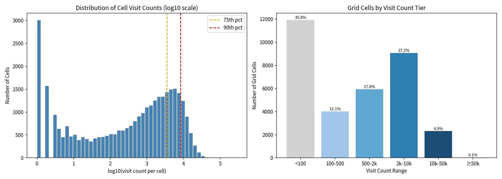

| 訪問量區間 | 格子數 | 累積訪問量 | 說明 |
|---|---|---|---|
| < 100 | 11,923 | 186,087 | 郊區/農地，幾乎無人 |
| 100 ~ 500 | 4,019 | 1,062,034 | 低密度住宅區 |
| 500 ~ 2,000 | 5,940 | 6,754,697 | 中密度住宅區 |
| **2,000 ~ 10,000** | **9,066** | **44,988,844** | **主要城市建成區（最大流量貢獻層）** |
| 10,000 ~ 50,000 | 2,311 | 34,886,466 | 高密度商業/交通節點 |
| **≥ 50,000** | **25** | 2,129,381 | **超核心熱點（精英層，僅 25 格）** |

名古屋的人流密度呈現**冪律分布**（Power-law Distribution）：11,923 個格子（36%）訪問量不足 100 次；而僅 25 個格子訪問量超過 50,000 次，集中在名古屋駅東西廣場核心。

### 5.3 實證比較：HDBSCAN vs. K-Means vs. DBSCAN

5.1 節以理論列舉了三種演算法的優劣，但「假設球狀分布」「全局固定密度」究竟會在真實資料上產生什麼後果？我們在**完全相同的 33,284 個訓練集格子**上，實際執行三種演算法並排比較：

- **HDBSCAN**：沿用 Run 1 設定（`min_cluster_size=10, min_samples=5`）
- **K-Means**：取 k=25，與本次 HDBSCAN 識別出的群集數對齊，讓「群數」這個變因公平
- **DBSCAN**：以 **k-distance 曲線的膝點（knee point）** 自動選取 eps（k=5，與 HDBSCAN 的 `min_samples` 對齊），避免人為調參偏見

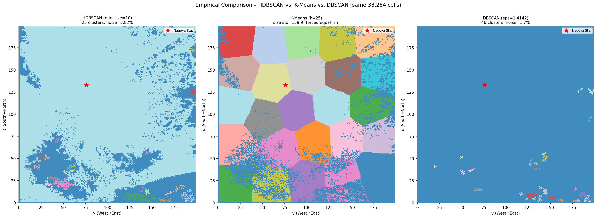

| 演算法 | 參數 | 群集數 | 雜訊比例 | 群集規模分布 |
|---|---|---|---|---|
| **HDBSCAN** | min_cluster_size=10 | 25 群 | 3.82%（1,270 格） | **10 ~ 31,321 格**（標準差 6,258.5；最大群佔全體 94.1%） |
| K-Means | k=25（對齊群數） | 25 群（強制） | 0%（無雜訊概念） | **929 ~ 1,557 格**（標準差僅 159.9，大小幾乎相等） |
| DBSCAN | eps=1.414（knee point 自動選取） | 46 群 | 1.7%（565 格） | 最大群佔全體 **97.1%**，其餘 45 群多為 1~50 格的破碎小島 |

**K-Means 的問題具象化**：被迫產生 25 個大小幾乎相等的群集（規模介於 929~1,557 格，標準差僅 159.9），而 HDBSCAN 識別出的真實群集規模橫跨 **10 至 31,321 格**（標準差 6,258.5，相差超過 39 倍）。地圖上可清楚看到 K-Means 把連續的市中心建成區切成數塊形狀怪異的「樂高積木」，且把性質迥異的郊區聚落強行併入同一個多邊形——它根本無法表達「一個超大城市核心 + 多個小型衛星城市」這種真實的多尺度結構。

**DBSCAN 的兩難具象化**：k-distance 曲線顯示，名古屋 33,284 個格子中有約 93% 的 5-近鄰距離都落在最小值 √2（對角相鄰），曲線幾乎貼著下緣平坦延伸，僅在最後不到 7% 處才急遽上揚（見下圖）。這正是 5.1.1 節「空間點密度趨於均勻」現象的直接體現——對 DBSCAN 而言，它所能選擇的全局 eps 幾乎只有兩種結果：取在平坦區（eps≈1.414，等同 8-鄰接連通元件分析）就會把 97.1% 的格子併成一團，喪失所有內部結構；要是取更大的 eps 想避免過度合併，則會在仍然連通的密集帶中產生更多碎片化雜訊。本次自動選取的膝點剛好落在平坦區的尾端（eps=1.414），於是出現「一個佔 97.1% 的巨型連通群 + 45 個 1~50 格的破碎小島」——同時印證了「全局單一密度門檻無法兼顧車站密集區與郊區稀疏區」的理論主張。

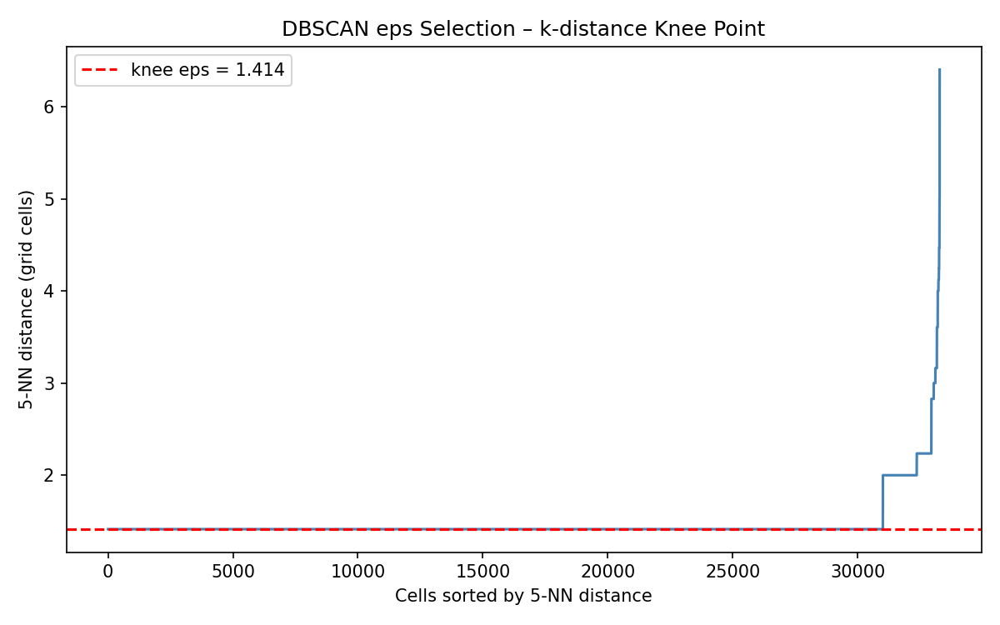

**HDBSCAN 的相對優勢**：在同樣的輸入與相近的雜訊比例（3.82% vs. DBSCAN 的 1.7%、K-Means 的 0%）下，HDBSCAN 是唯一能夠**同時**保留「巨型連續核心」與「多個小型獨立衛星」兩種尺度結構的演算法——這正是名古屋真實空間結構的寫照（5.4 節 Run 1 的「一巨核 + 散落衛星」現象），而非演算法強加的人工切割。

> 程式碼：`analysis/hdbscan_deepdive.py::run_comparison`；DBSCAN eps 以 k-distance 曲線到端點連線的最大垂直距離（knee heuristic）自動決定。

### 5.4 三層參數敏感性分析

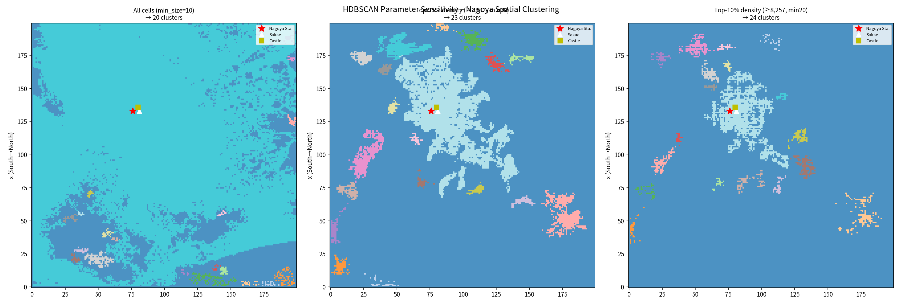

為解析不同密度層下的空間結構，對訓練集執行三組 HDBSCAN，逐步縮小輸入範圍至最核心的高密度格子：

| 執行設定 | 輸入格子範圍 | 密度門檻 | min_cluster_size | 識別群數 | 雜訊點數 |
|---|---|---|---|---|---|
| **Run 1**：全資料 | 33,284 格（全部） | 無 | 10 | **20 群** | 1,316 |
| **Run 2**：前 25% 密度 | ~8,321 格 | ≥ 3,511 次 | 30 | **23 群** | 2,441 |
| **Run 3**：前 10% 密度 | ~3,328 格 | ≥ 8,257 次 | 20 | **24 群** | 923 |

**Run 1 現象（一巨核 + 散落衛星）**：對全部格子執行時，HDBSCAN 將整個建成區識別為一個超大群集（Cluster 18，覆蓋 31,352 格，佔 94.2%）。這是名古屋都市圈真實空間結構的如實反映——在 500m 網格尺度下，建成區是一個不間斷的連續密度場。外圍 19 個小群集對應豊田、岐阜、四日市等遠郊衛星城市。

**Run 3 的意義（解析城市內部熱點景觀）**：將輸入限縮至「頂尖 10% 密度格子」時，城市核心被解構為 24 個獨立的高密度核心，每個對應一個真實的城市機能節點（車站、大學、商圈、辦公區等）。

#### 5.4.1 系統化參數敏感度掃描：兩個變因各自的影響

上述 Run 1~3 同時調整了「輸入格子範圍」與「`min_cluster_size`」兩個變因，難以判斷各自的貢獻。我們進一步設計了**兩組獨立掃描實驗**，分別固定一個變因、系統性地改變另一個：

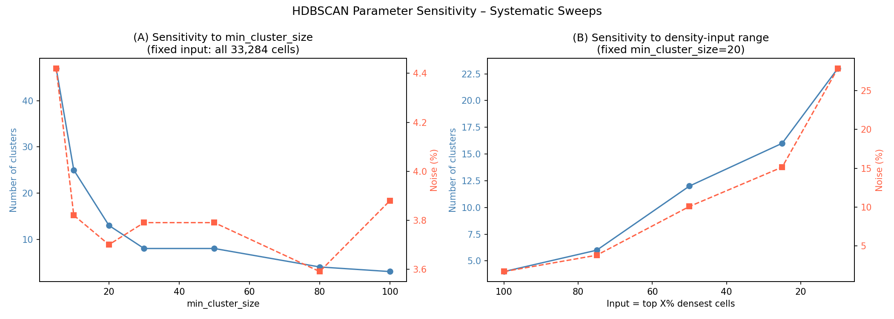

**(A) 固定輸入＝全部 33,284 格，掃描 `min_cluster_size`（5 → 100）**

| min_cluster_size | 5 | 10 | 20 | 30 | 50 | 80 | 100 |
|---|---|---|---|---|---|---|---|
| 識別群數 | 47 | 25 | 13 | 8 | 8 | 4 | 3 |
| 雜訊比例 | 4.42% | 3.82% | 3.70% | 3.79% | 3.79% | 3.59% | 3.88% |

群集數隨 `min_cluster_size` 增加而**單調遞減**（47 → 3），但雜訊比例卻幾乎不變、穩定維持在 **3.6% ~ 4.4%** 之間的窄帶。原因在於：當輸入是全部格子時，整個建成區早已被判為一個「巨型連通核心」，調整 `min_cluster_size` 主要影響的是**外圍小型衛星群集要被合併、保留、還是併入雜訊**，而不會撼動巨型核心本身——因此群集數量大幅變化，但整體雜訊量級維持穩定。**這說明 `min_cluster_size` 主要是「外圍解析度」的調節旋鈕，而非決定核心結構的關鍵參數。**

**(B) 固定 `min_cluster_size=20`，掃描輸入密度門檻（保留前 100% / 75% / 50% / 25% / 10% 密度格子）**

| 輸入範圍 | 全部（100%） | 前 75% | 前 50% | 前 25% | 前 10% |
|---|---|---|---|---|---|
| 輸入格數 | 33,284 | 24,990 | 16,648 | 8,322 | 3,330 |
| 識別群數 | 4 | 6 | 12 | 16 | 23 |
| 雜訊比例 | 1.67% | 3.78% | 10.07% | 15.14% | 27.87% |

相較於 (A)，這組掃描呈現截然不同、且**乾淨的單調趨勢**：隨著輸入範圍向高密度收斂，識別群數從 4 路增加到 23（成長近 6 倍），雜訊比例也同步從 1.67% 攀升到 27.87%（成長近 17 倍）。這正好呼應 5.1.1 節的發現——**收斂輸入範圍＝主動移除「中密度過渡帶」格子，把原本均勻的空間點密度重新「打散」成有意義的密度梯度**，讓 HDBSCAN 得以解析出更細緻的內部結構；代價則是被移除的過渡帶格子大量淪為雜訊。

**結論：density-threshold 是真正的解析度旋鈕，`min_cluster_size` 只是輔助調整**。本研究選擇 Run 3（前 10% 密度、`min_cluster_size=20`）作為深度分析的基準，正是在「解析度」（23 個獨立熱點）與「雜訊代價」（27.87%，約佔輸入的四分之一）之間取得的權衡點——再往核心收斂雖能解析出更多節點，但雜訊比例將進一步攀升，反而稀釋了分析的代表性。

> 程式碼：`analysis/hdbscan_deepdive.py::sweep_min_cluster_size` / `sweep_density_threshold`。注意：本節重新執行的 HDBSCAN 結果（如 (A) 中 min_cluster_size=10 → 25 群、噪訊 3.82%）與 5.4 節 Run 1（20 群、3.95%）存在小幅差異，原因與第 2.2 節「格子數差異」說明相同——HDBSCAN 的 Boruvka 演算法在平局（tie）時的內部排序可能因執行環境（套件版本、執行緒數）產生極小的標籤差異，不影響趨勢與結論的有效性。

### 5.5 Run 3 群集詳細結果

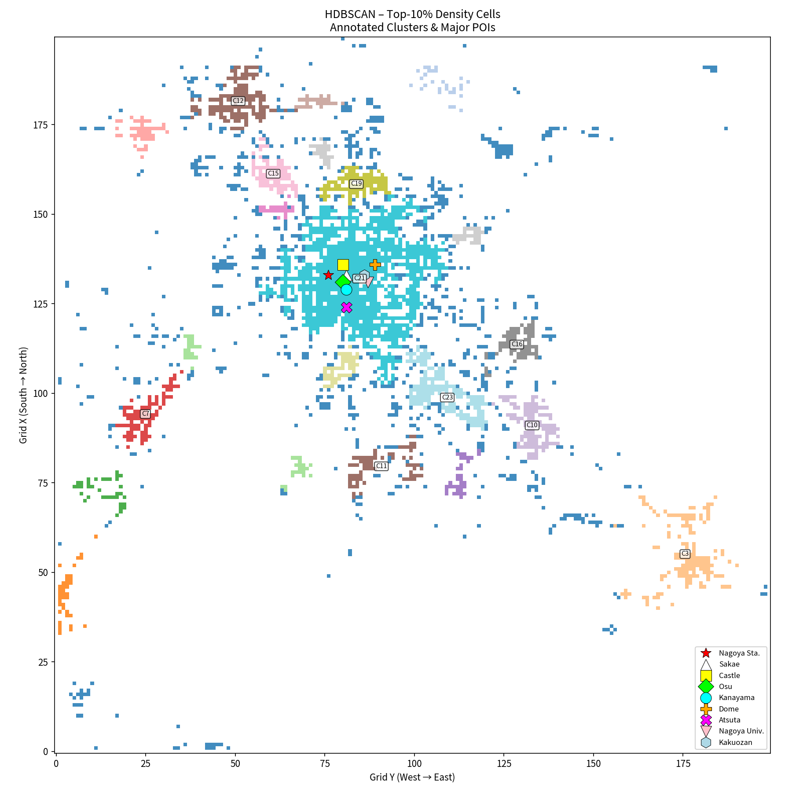

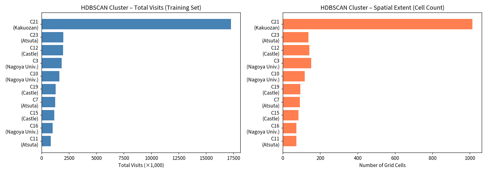

Run 3 識別出的前 12 大群集（按訪問量排序）：

| Cluster ID | 格子數 | 75 天總訪問量 | 群集中心（緯, 經） | 推估地理位置 |
|---|---|---|---|---|
| **21** | **1,013** | **17,275,130** | 35.166°N, 136.926°E | **名古屋中心城區主核心** |
| 23 | 136 | 1,958,065 | 34.998°N, 137.049°E | 東南方（知立・刈谷）衛星區 |
| 12 | 141 | 1,956,232 | 35.417°N, 136.757°E | 北方（岐阜南部）衛星區 |
| 3 | 151 | 1,824,826 | 34.778°N, 137.382°E | 東方（豊橋方向）衛星區 |
| 10 | 116 | 1,608,677 | 34.959°N, 137.168°E | 東南（豊田市）衛星區 |
| 19 | 93 | 1,265,483 | 35.299°N, 136.922°E | 春日井・小牧周邊 |
| 7 | 90 | 1,231,507 | 34.975°N, 136.627°E | 西南（桑名方向）衛星區 |
| 15 | 83 | 1,147,974 | 35.314°N, 136.806°E | 小牧市區周邊 |
| 16 | 72 | 1,001,666 | 35.073°N, 137.146°E | 知立・刈谷南部 |
| 11 | 72 | 817,010 | 34.901°N, 136.957°E | 大府・東海方向 |
| 8 | 47 | 619,559 | 35.373°N, 136.622°E | 一宮市周邊 |
| 20 | 47 | 595,452 | 35.040°N, 136.900°E | 名古屋南部（瑞穂周邊） |

**極端集中現象**：Cluster 21（名古屋中心城區主核心）即使在僅保留前 10% 密度格子的嚴格條件下，仍覆蓋 1,013 個格子（佔所有輸入格子的 **30.4%**），75 天總訪問量達 **1,728 萬次**，是第二大群集（196 萬次）的 **8.8 倍**。這揭示名古屋人流在城市尺度上的壓倒性集中——整個大名古屋都市圈的人流幾乎全部集中在名古屋駅—榮—大須核心廊道。

### 5.6 群集的時間維度：熱點的晝夜與工作日／假日節奏

第 5.5 節僅刻劃了群集的**空間**結構（在哪裡、多大、多少人）。為了把「空間分群」與第 6 章「POI 時序分析」這兩條分析線縫合起來，我們對 Run 3 識別出的前 6 大群集，套用與 6.1~6.5 節相同的手法——計算每個群集範圍內的工作日／假日活躍使用者時序曲線、尖峰時間與工/假日比：

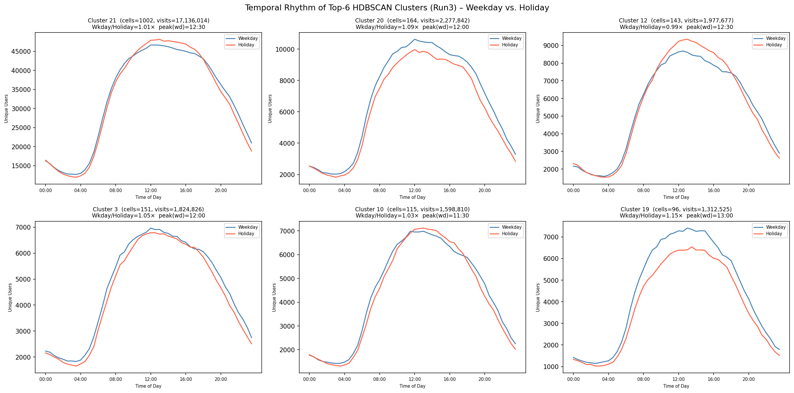

| 群集（地理位置） | 格數 | 75 天總訪問量 | 工/假日比 | 工作日尖峰 | 假日尖峰 |
|---|---|---|---|---|---|
| 名古屋中心城區主核心 | 1,002 | 17,136,014 | **1.01×** | 12:30 | 13:00 |
| 知立・刈谷衛星區 | 164 | 2,277,842 | 1.09× | 12:00 | 12:00 |
| 岐阜南部衛星區 | 143 | 1,977,677 | **0.99×** | 12:30 | 13:00 |
| 豊橋方向衛星區 | 151 | 1,824,826 | 1.05× | 12:00 | 12:00 |
| 豊田市衛星區 | 115 | 1,598,810 | 1.03× | 11:30 | 13:00 |
| 春日井・小牧周邊 | 96 | 1,312,525 | **1.15×** | 13:00 | 13:30 |

**核心發現——「縮時鏡頭」與「廣角鏡頭」看到不同的故事**：第 6 章 5 個 POI（名古屋駅、名古屋大學、名古屋城、大須商店街、金山，半徑 1.5~2.5km）的工/假日比介於 **1.24~1.32×**，呈現一致且明顯的「工作日 > 假日」格局；但把鏡頭拉遠到群集尺度（每個群集橫跨數十至上千個格子、面積達數十平方公里）後，六大群集的工/假日比卻**全部緊縮到 0.99~1.15× 的窄帶**——其中名古屋中心城區主核心（涵蓋第 6 章全部 5 個 POI 所在地）的比值僅 **1.01×**，幾乎完全打平，遠低於其內部任何單一 POI 的比值。

這個「比值被攤平」的現象並非矛盾，而是**空間尺度效應（scale effect）的具體例證**：POI 是半徑 1.5~2.5km 的「單一機能地標」，其人流由單一主導用途（交通、商辦、行政、商業）支配，工/假日落差被放大、清晰可辨；群集卻是涵蓋數十平方公里的「複合機能區域」，內部同時混雜了辦公核心（工作日強）、住宅社區（假日強）、商業娛樂（假日略強）、交通節點（工作日強）等多種用途——**各種子區域的工/假日偏向相互抵銷、平均後便趨近於 1**。換言之，**「名古屋中心城區工作日人流比假日多」這個結論，只在「地標尺度」上成立；一旦把分析窗口放大到「行政區/生活圈尺度」，這個訊號幾乎消失**。這也呼應了第 6.6 節「名古屋市中心高度混合用途規劃」的觀察——城市機能在空間上交錯密布到一定程度後，宏觀統計量會自然趨於平衡。

至於遠郊衛星群集，雖然平均仍略高於 1（春日井・小牧 1.15× 最高、岐阜南部 0.99× 最低、近乎持平），並未出現原先預期中「假日出遊型熱點」的明顯反轉（ratio < 1 且差距顯著）——這提示這些衛星群集本身也是「複合機能」的地方城鎮（同樣混雜通勤、居住、消費機能），而非單純的觀光目的地，其時序節奏因而與市中心呈現出驚人的相似性（多數尖峰落在 12:00~13:30 之間），進一步印證了第 6.6 節「純觀光 vs. 純辦公的二元區分在空間資料中幾乎不存在」的論點——這個論點不僅適用於市中心 POI，在更大的群集尺度與遠郊衛星城市上同樣成立。

> 程式碼：`analysis/hdbscan_deepdive.py::cluster_temporal_rhythm`；地理位置以與表 5.5（Run 3 詳細結果）相同的座標比對方式標註——由於本節重新執行 HDBSCAN（與 5.4.1 節相同原因），群集 ID 與 5.5 節表格略有出入，但中心座標與地理範圍一致，可視為同一組熱點。

### 5.7 HDBSCAN 分群的下游應用

HDBSCAN 的輸出直接服務於後續 CVAE 模型的特徵工程：

1. **CVAE 條件向量**：每位使用者在訓練集中歷史訪問量前 3 的群集 ID，編碼為 One-hot 向量，讓模型「知道」使用者主要活動在哪個城市功能區。
2. **移動類型分類基礎**：結合群集分布與穩定性分數，透過 K-Means（k=4）分出固定通勤型、城市漫遊型、多核心型、隨機型四種移動類型。
3. **格子語意標籤**：Run 1 的群集標籤為每個格子提供「城市功能區語意」，可用於解釋預測軌跡的目的地是否落在合理的城市功能區內。

---

## 6. 主要 POI 深度分析

本節對名古屋 5 個代表性地標進行深度人流分析，涵蓋交通樞紐、學術、歷史、商業等不同功能類型。空間篩選均採用**方形 bounding box**（程式碼 `x.between(cx−r, cx+r) & y.between(cy−r, cy+r)`）。名古屋車站取 r=5（±5 格，每邊 11 格 × 0.5km，總範圍約 **5.5km × 5.5km**）；其餘 4 個 POI 取 r=3（±3 格，每邊 7 格，總範圍約 **3.5km × 3.5km**）。

### 6.1 名古屋車站

名古屋車站（名古屋駅）是東海地區最大的交通樞紐，東海道新幹線、JR、名鐵、近鐵、名古屋市地下鐵等多路線的交匯點，對應網格座標 **(x=133, y=76)**。

| 指標 | 數值 |
|---|---|
| 75 天總訪問次數 | 3,984,410 次 |
| 唯一使用者數 | **69,540 人（佔全體 69.5%）** |
| 每工作日平均在場使用者數 | 14,346 人 |
| 每假日平均在場使用者數 | 11,149 人 |
| 工作日 / 假日 比值 | **1.29×** |
| 全日尖峰時間 | **12:30** |

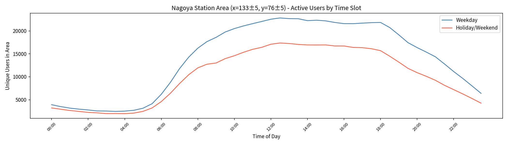

**特徵解讀**：名古屋近 70% 的使用者在 75 天中至少一次出現在車站 2.5km 範圍內，說明車站是整個都市圈無可替代的中樞節點。工作日/假日比（1.29×）低於直覺預期，原因是車站地下街（名鉄百貨、JR タカシマヤ）假日人潮也極旺，有效補充了通勤人流下降的缺口。尖峰在 12:30 而非早晨通勤，反映午休人群在車站附近停留時間較通勤族更長。

### 6.2 名古屋大學

名古屋大學（名古屋大学）位於千種區東山地區，對應網格座標 **(x=131, y=87)**。

| 指標 | 數值 |
|---|---|
| 75 天總訪問次數 | 1,024,269 次 |
| 唯一使用者數 | **42,291 人（佔全體 42.3%）** |
| 工作日 / 假日 比值 | **1.24×（五者最低）** |
| 全日尖峰時間 | **13:00** |

**特徵解讀**：覆蓋率最低（42.3%），原因是校區位於城市東側住宅教育區，並非大多數人的通勤路徑。工/假日比最低（1.24×），因半徑範圍內的東山動植物園是週末出遊熱點，有效補充了假日流量；大學醫院週七天持續門診也提供了穩定的基礎人流。

### 6.3 名古屋城

名古屋城（名古屋城）是日本三大名城之一，緊鄰愛知縣廳和名古屋市政府，對應網格座標 **(x=136, y=80)**。

| 指標 | 數值 |
|---|---|
| 75 天總訪問次數 | 2,910,571 次 |
| 唯一使用者數 | **66,848 人（佔全體 66.8%）** |
| 工作日 / 假日 比值 | **1.32×（五者最高）** |
| 全日尖峰時間 | **13:30** |

**特徵解讀**：工/假日比最高（1.32×），原因是 1.5km 半徑內的愛知縣廳、名古屋市役所等行政機關在假日幾乎完全停止人流，而城址的門票制入場設計也限制了假日隨機訪客。尖峰時間最晚（13:30），反映行政機關午休時間普遍從 12:00 開始，13:00~14:00 才是最多人在外的時段。

### 6.4 大須商店街

大須商店街（大須商店街）是名古屋最古老、最具活力的商業街區，融合傳統文化、次文化與多國料理，對應網格座標 **(x=131, y=80)**。

| 指標 | 數值 |
|---|---|
| 75 天總訪問次數 | 2,178,102 次 |
| 唯一使用者數 | **64,022 人（佔全體 64.0%）** |
| 工作日 / 假日 比值 | **1.29×** |
| 全日尖峰時間 | **13:00** |

**特徵解讀**：雖然直覺上大須應該是「週末才熱鬧」的商業街，但資料顯示工作日人流比假日高 29%，與交通樞紐名古屋駅的比值完全相同。原因是 1.5km 半徑向北涵蓋了**榮（栄）商業辦公核心**，辦公族在工作日產生的基礎流量非常可觀。早晨幾乎無波峰（商店通常 10:00~11:00 才開門），是五者中最具商業性質的時間曲線。

### 6.5 金山

金山（金山）是名古屋南部最重要的換乘樞紐，匯聚地鐵、名鐵、JR 多條路線，附近有愛知縣藝術劇場，對應網格座標 **(x=129, y=81)**。

| 指標 | 數值 |
|---|---|
| 75 天總訪問次數 | 1,669,878 次 |
| 唯一使用者數 | **56,639 人（佔全體 56.6%）** |
| 工作日 / 假日 比值 | **1.27×** |
| 全日尖峰時間 | **13:00** |

**特徵解讀**：五者中唯一有明顯早晨通勤小波峰（08:00~09:00），與名古屋駅的雙峰曲線最為相似，反映多線換乘站早晨通勤時段大量乘客「下車換乘」的短暫但密集的出現。覆蓋率（56.6%）居中，說明金山的影響力以南名古屋居民（中川區、南區、熱田區）為主，並非全市性的必經節點。

### 6.6 五 POI 綜合比較

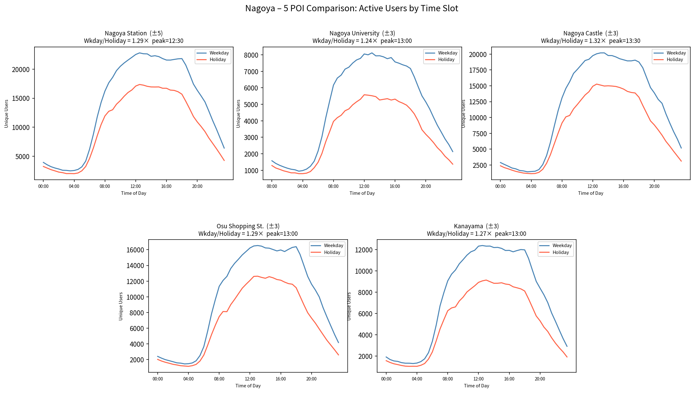

| 維度 | 名古屋車站 | 名古屋大學 | 名古屋城 | 大須商店街 | 金山 |
|---|---|---|---|---|---|
| 功能類型 | 交通樞紐（全市） | 學術機構 | 歷史觀光＋行政 | 商業娛樂 | 交通樞紐（南部） |
| 75 天總訪問量 | **3,984,410** | 1,024,269 | 2,910,571 | 2,178,102 | 1,669,878 |
| 使用者覆蓋率 | **69.5%（最高）** | 42.3%（最低） | 66.8% | 64.0% | 56.6% |
| 工/假日比 | 1.29× | 1.24×（最低） | **1.32×（最高）** | 1.29× | 1.27× |
| 尖峰時間 | **12:30**（最早） | 13:00 | **13:30**（最晚） | 13:00 | 13:00 |
| 早晨通勤峰 | **有（明顯）** | 無 | 弱 | 無 | 有（明顯）|

**共同規律**：全部 5 個 POI 的工作日人流均高於假日（比值 1.24~1.32×），這與「觀光、購物景點假日更熱鬧」的直覺相悖。根本原因在於：名古屋市中心任何範圍都包含大量辦公建築，辦公人流在工作日的絕對優勢壓過假日的觀光/消費補充。名古屋的城市規劃高度混合用途——歷史景點（名古屋城）與行政辦公（縣廳）毗鄰，商業街（大須）與辦公核心（榮）緊緊相鄰，使得「純觀光 vs. 純辦公」的二元區分在空間資料中幾乎不存在。

---

## 7. 個人軌跡特徵分析

從每位使用者的個人行為模式出發，進行四項深度分析：工作日/假日移動標準差對比、DTW 通勤規律性、個人行為反推城市 POI、以及生活圈 HDBSCAN 聚類。

### 7.1 工作日 vs. 假日移動標準差

**方法**：對每位使用者計算所有訓練天（d≤60）中每個時間步的位置標準差，分別在工作日和假日上獨立計算。

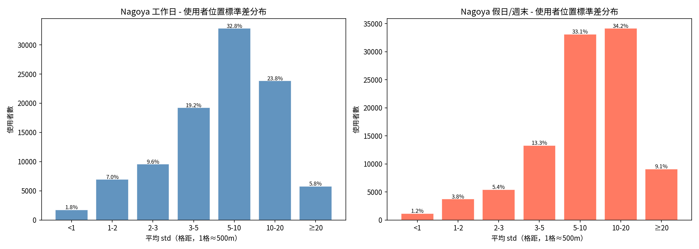

| 標準差區間 | 工作日人數（比例） | 假日人數（比例） |
|---|---|---|
| std < 5 小計 | **37,523（37.5%）** | **23,616（23.6%）** |
| 5–10 | 32,835（32.8%） | 33,120（33.1%） |
| 10–20 | **23,842（23.8%）** | 34,156（34.2%） |
| ≥ 20 | **5,800（5.8%）** | 9,108（9.1%） |
| **平均 std** | **8.27** | **10.28** |
| **中位數 std** | **6.54** | **8.86** |

*全部數字已由全體 100,000 使用者完整重跑驗證。*

**核心發現**：工作日平均 std（8.27）明顯低於假日（10.28）。假日的 std ≥ 10 比例從工作日的 29.6% 上升到 43.3%，高標準差族群幾乎增加了一半。此差異直接意味著假日軌跡預測的整體難度更高，需要更強的生成模型。

### 7.2 DTW 通勤規律性分析

**方法**：對工作日標準差落在 5~20 的使用者（符合條件 56,677 人，56.7%），取通勤時段 t=16~36（08:00~18:00）的軌跡，計算每天與「平均軌跡」的 DTW 距離。隨機採樣 3,000 位使用者分析。

| 指標 | 數值 |
|---|---|
| DTW 平均值 | 288.83 |
| DTW 中位數 | 255.42 |
| 高規律（DTW < 100） | 3.9% |
| 中規律（DTW 100–300） | **58.3%** |
| 低規律（DTW ≥ 300） | 37.8% |
| std 與 DTW 相關係數 | **r = 0.695** |

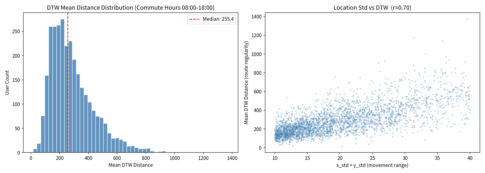

**核心洞察**：
- **std 與 DTW 高度正相關（r=0.695），但非線性**：有一群使用者 std 偏大但 DTW 偏小，代表他們活動範圍廣但每天走相同路線（如長途通勤者）。
- **多數使用者通勤路線「中等規律」（58.3%）**：日常通勤有固定骨架，但每天起訖時間和中途點有輕微變化。
- **DTW 補充了 std 無法揭示的資訊**：std 衡量每個時間點的位置散佈，DTW 衡量整條軌跡的形狀相似度，兩個指標合用能更完整地量化個人移動規律。

### 7.3 個人行為特徵反推城市 POI

**方法**：從每位使用者的工作日行為中抽取三種特徵點——Home（深夜/清晨最常出現的格子）、Work（白天最常出現的格子）、Hotspot（全部訓練天最常出現的格子）。彙整 100,000 位使用者的特徵點，按出現頻率排序，過濾相距 < 2 格（< 1km）的重複點，取前 30 名作為城市 POI。

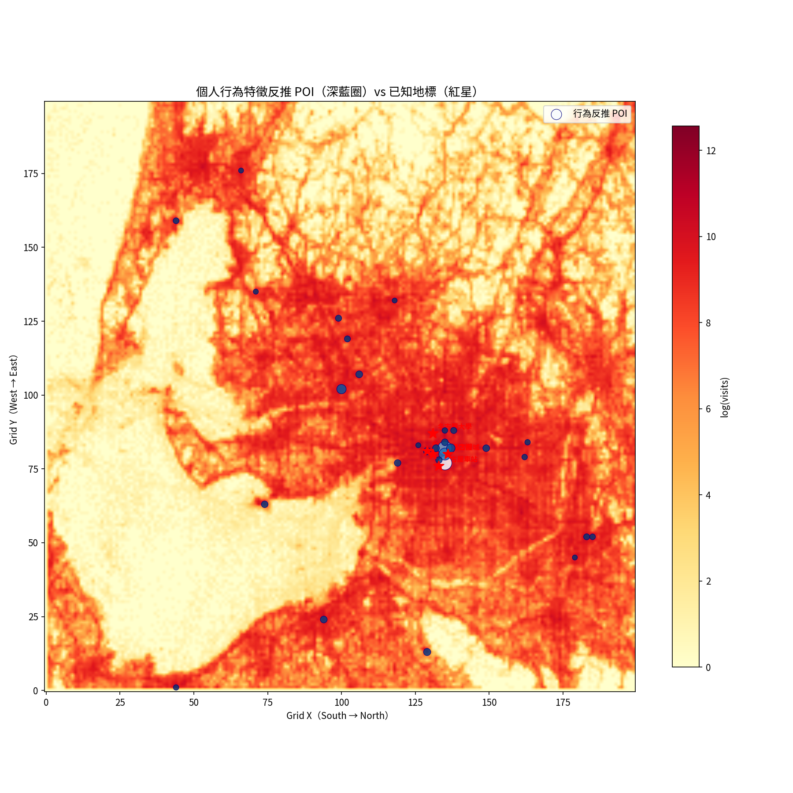

| 排名 | Grid (x, y) | 緯度 | 經度 | 頻率 | 推估地點 |
|---|---|---|---|---|---|
| 1 | (135, 77) | 35.181° | 136.888° | 1,084 | 名古屋車站東口 |
| 2 | (135, 82) | 35.181° | 136.913° | 582 | 栄・久屋大通 |
| 3 | (135, 80) | 35.181° | 136.903° | 394 | 名駅～伏見間 |
| 4 | (100, 102) | 35.004° | 137.013° | 279 | 豐田市周邊 |
| 5 | (137, 82) | 35.191° | 136.913° | 250 | 丸の内・伏見 |

**個人行為反推法 vs. HDBSCAN 全域熱力法的比較**：兩種方法的 Top-1 POI 完全一致（名古屋車站 (135, 77)），印證車站作為城市核心的地位。差異在於：個人行為反推法更能識別出**居住密集帶**（如第 4 名的豐田市郊區），這些地點在全域訪問熱力圖上因人流量絕對值較低而不突出，但在「多少人的 home 在這裡」的視角下卻是重要的生活核心。

### 7.4 生活圈 HDBSCAN 聚類

**方法**：對每位使用者計算其全部訓練天的活動 bounding box（bbox_xmin, bbox_ymin, bbox_xmax, bbox_ymax），以此 4 維向量執行 HDBSCAN（min_cluster_size=300, min_samples=350）。

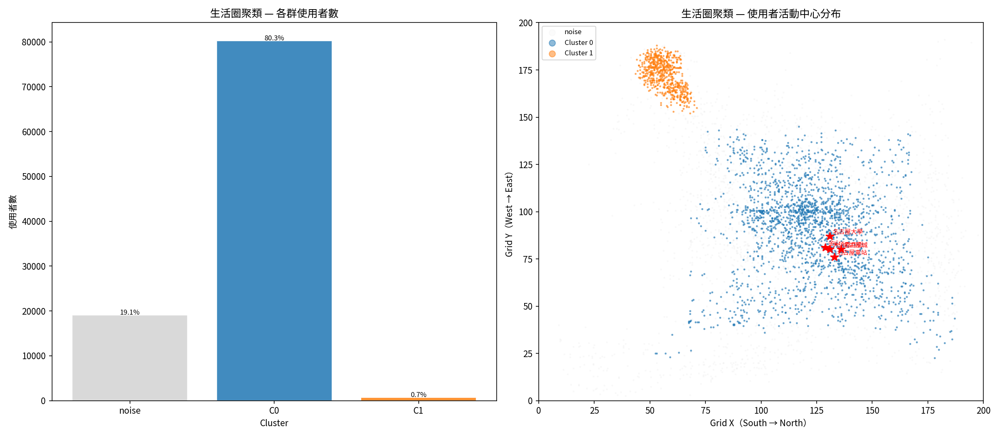

| 群組 | 使用者數 | 比例 | 活動中心 (x, y) | 平均活動範圍 |
|---|---|---|---|---|
| **Cluster 1**（名古屋都市圈） | 80,269 | **80.3%** | (122.8, 90.1) | 107 × 123 格（≈ 54km × 62km） |
| Cluster 0（東南遠郊） | 672 | 0.7% | (56.6, 172.3) | 38 × 45 格 |
| Noise（分散型） | 19,059 | **19.1%** | — | 71 × 77 格 |

**結果解讀**：
- **80% 的使用者共享同一個名古屋都市圈生活圈**，活動範圍高達 54km × 62km，覆蓋整個大名古屋都會區。
- **0.7% 的使用者是東南遠郊生活圈**（豐橋・豐川一帶），活動範圍相對集中，可能是在三河地區工作、偶爾進名古屋的通勤者。
- **19.1% 的雜訊代表高度分散型使用者**，可能包括外地出差者、短期訪客或高度流動的商務人士。
- 僅識別出 2 個明顯群集，說明城市生活圈高度集中——名古屋都市中心的吸引力如此之強，以至於大多數人的生活重心均落在同一個大生活圈內。

---

## 8. 模型方法

### 8.1 基準模型（Baseline）

建立四種統計基準模型作為評估下限：

| 模型 | 核心原理 |
|---|---|
| **Per-User Mode** | 每位使用者在相同（weekday, t）下最常出現的位置（眾數），三層 fallback：(uid, weekday, t) → (uid, t) → (weekday, t) → 全域眾數 |
| **Per-User Mean** | 每位使用者在相同（weekday, t）下的歷史平均位置（取整），相同 fallback 邏輯 |
| **Bigram** | 一階馬可夫模型：P(下一格 \| 當前格, t)，取最高機率轉移 |
| **Bigram top_p=0.7** | Bigram + top-p 隨機取樣（累積機率 70% 內隨機選，增加多樣性）|

Baseline 使用 d≤60 的訓練資料建立統計表，對 d=61~75 進行預測。三層 fallback 策略確保即使在稀疏歷史資料情況下也能生成合理的預測。

### 8.2 評估指標

- **GEO-BLEU**（β=0.5, n=5）：空間序列相似性，參考 NLP BLEU 設計，計算預測軌跡與真實軌跡的 n-gram 匹配，越高越好
- **FDE（Final Displacement Error）**：預測終點 vs. 真實終點的格子距離，越低越好

### 8.3 Conditional VAE 生成模型

採用 **Conditional VAE + LSTM**，結合空間、穩定性與時序條件特徵進行軌跡生成。

#### 模型架構

```
輸入 x（48 時步軌跡序列）+ 條件向量 y
    │
    ▼
Encoder（LSTM × 2 層 + Linear）
    ├── 輸出 μ, log_σ²（潛在空間參數）
    └── z = μ + ε·σ  （重參數化技巧）
    │
    ▼
Decoder（Linear → LSTM × 2 層 → Linear）
    └── 輸出 48 時步座標序列（x̂, ŷ），sigmoid 正規化至 [0, 1]
```

#### 條件向量設計（共 97 維）

| 特徵 | 維度 | 來源 | 意義 |
|---|---|---|---|
| 使用者前 3 大熱點 One-hot | 27 × 3 = **81** | HDBSCAN（10K 樣本，27 群） | 使用者主要活動的城市功能區 |
| repeat_rate | 1 | 軌跡穩定性分析 | 歷史軌跡重複率 |
| weekday_entropy | 1 | 工作日空間熵 | 工作日活動範圍分散程度 |
| holiday_entropy | 1 | 假日空間熵 | 假日活動範圍分散程度 |
| profile_diff | 1 | 工/假日輪廓差異（餘弦距離） | 使用者工假日行為差異度 |
| 移動類型 One-hot | 4 | K-Means（k=4）分群 | 固定通勤/城市漫遊/多核心/隨機 |
| 是否假日 | 1 | K-Means 假日分類 | 當天的日曆類型 |
| 星期幾 One-hot | 7 | d % 7 | 週內循環特徵 |
| **合計** | **97** | | |

> **注意**：CVAE 訓練所用的 HDBSCAN 是以 10,000 人的訓練資料重新執行，識別出 27 個非雜訊群集（第 5 章全體 100K 人資料的 Run 1 識別出 20 群，是不同資料規模執行的結果）。Checkpoint 的 `encoder.condition_embed.weight` shape 為 [128, 97]，與此維度一致。

條件向量的設計邏輯：讓解碼器在生成軌跡時，能同時考慮「這個人的長期行為模式（穩定性、生活圈）」和「今天是什麼類型的日子（工作日/假日、星期幾）」。

#### 損失函數

$$\mathcal{L} = \underbrace{\text{MSE}(\hat{x}, x)}_{\text{重建損失}} + \beta \cdot \underbrace{\text{KL}(q_\phi(z|x,y) \| p(z))}_{\text{KL 正則化}}$$

β=1.0，平衡重建精度與潛在空間的多樣性。

#### 訓練設定

| 參數 | 數值 |
|---|---|
| Epochs | 50 |
| Batch Size | 256 |
| Learning Rate | 1e-3（Adam） |
| Latent Dim | 64 |
| Hidden Dim | 128 |
| 裝置 | NVIDIA RTX 4050 Laptop（6GB VRAM）|

---

## 9. 實驗結果與評估

### 9.1 Baseline 評估結果

使用全體 100,000 名使用者的訓練資料（d≤60）建立模型，對 d=61~75（15 天）進行預測，以 GEO-BLEU 和 FDE 評估。

| 模型 | GEO-BLEU | FDE（格子數） |
|---|---|---|
| **Bigram** | **0.16950** | 8.98 |
| Per-User Mode | 0.15904 | 8.86 |
| Bigram top_p=0.7 | 0.15841 | 8.94 |
| Per-User Mean | 0.09852 | 8.63 |

**ACM SIGSPATIAL GIS Cup 2025 競賽資料集發布之參考基準（跨多城市範圍）**：

| 方法 | 競賽參考 GEO-BLEU 範圍 |
|---|---|
| Per-User Mode | 0.07984 ~ **0.10789** |
| Bigram top_p=0.7 | 0.07039 ~ 0.09384 |
| Bigram | 0.04687 ~ 0.06249 |
| Per-User Mean | 0.01492 ~ 0.02637 |

> **注意**：本地分數（0.170）高於競賽參考值（最高 0.108），原因是競賽數字涵蓋多個城市且測試集切法可能不同，並非直接可比。**值得注意的是，本地排序（Bigram > Mode）與競賽參考排序（Mode > Bigram）相反**：本地有完整 100K 使用者歷史記錄，Bigram 轉移矩陣統計充足；競賽跨城市測試集可能含有歷史記錄稀少的使用者，此時 Mode 的多層 fallback 機制更穩健，而 Bigram 因稀疏歷史退化。

> 本地評估指令：  
> `uv run python main.py --city-path raw_data/nagoya_challengedata.csv --skip-features --run-baselines`

### 9.2 CVAE 生成模型結果

CVAE 模型以隨機抽取的 **10,000 名使用者**（佔全體 10%）進行訓練與評估（sample_users=10000），GPU（NVIDIA RTX 4050）訓練 50 epochs，checkpoint：`cvae_ep50_u10000.pt`。

> **評估限制**：下表的 Per-User Mode 是在**全體 100,000 人**上訓練與評估，CVAE 僅在 **10,000 人的子集**上評估，兩者評估母體不同，數字不直接可比。以同樣 10K 人評估 Per-User Mode 的分數可能略低或略高於 0.159（因樣本特性不同），目前沒有同口徑的對照基準。

| 模型 | 評估母體 | GEO-BLEU | FDE（格子數） |
|---|---|---|---|
| Per-User Mode（基準） | 100,000 人 | 0.15904 | 8.86 |
| **CVAE（50 epochs, 10000 人）** | **10,000 人** | **0.001172** | **29.41** |

**分數偏低的原因分析**：

1. **Exposure Bias**：訓練時以 Teacher Forcing 餵真實座標，推論時改用自回歸生成，造成誤差逐步累積；第一時步的輕微偏差在 48 步後被放大，導致位置嚴重漂移。
2. **FDE 高達 29.4 格（約 14.7km）**：印證推論階段的軌跡漂移問題。
3. **任務難度本身極高**：即使是 Baseline 的 Bigram（GEO-BLEU=0.169），也遠低於行人級別的「完美預測」，顯示個人自由移動的內在隨機性極強。

#### 9.2.1 預測軌跡 vs 實際軌跡比較

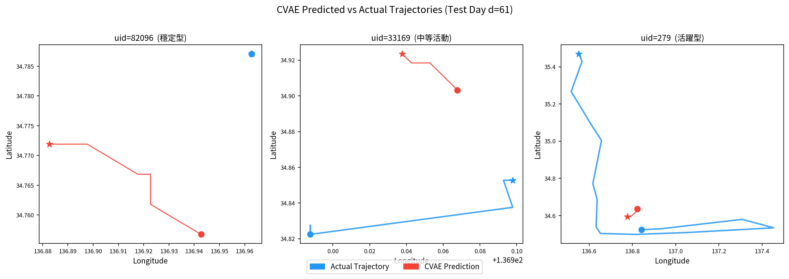

三位典型使用者（穩定型、中等活動、活躍型）在測試日 d=61 的實際軌跡（藍）與 CVAE 預測軌跡（紅）對比。穩定型使用者的預測軌跡與實際位置最為接近；活躍型使用者因移動範圍廣，CVAE 預測偏離較大，反映出生成模型對高熵使用者的捕捉仍有挑戰。

#### 9.2.2 空間密度分布比較

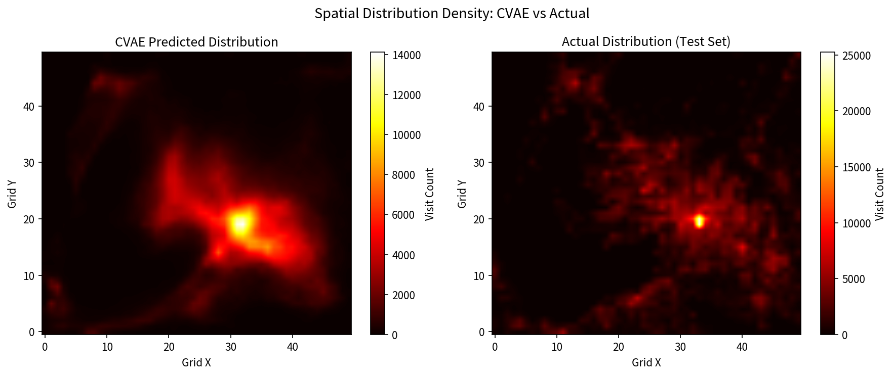

聚合 10,000 名使用者於 d=61~75 的所有預測記錄與實際記錄，繪製 50×50 格網熱力圖。**實際分布**（右）高度集中於名古屋市中心廊道，體現冪律特性；**CVAE 預測分布**（左）雖整體輪廓與實際分布一致（中心城區密度最高），但空間焦點較為分散，部分位置的絕對密度被低估。兩者吻合的結構表明 CVAE 學到了名古屋城市的基本空間規律，漂移問題主要影響個別軌跡的精確性而非全局分布。

#### 9.2.3 終點位移誤差（FDE）分布

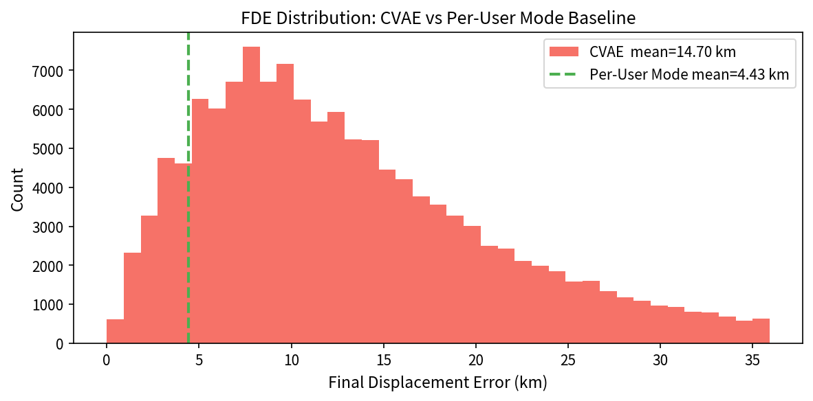

CVAE 的 FDE 分布（紅色直方圖）中位數約 12km，遠高於 Per-User Mode 的 4.43km（綠色虛線）。分布呈現右偏長尾，說明部分使用者的軌跡預測誤差極大（推論漂移集中在特定難以預測的使用者），而非均勻地偏差。

**CVAE 模型理論優勢**：
- 生成模型能夠對同一使用者/同一天生成**多樣化的可能軌跡**，而非 Baseline 的單一確定預測，理論上能更好地反映人類移動的隨機性。
- 條件向量中的 HDBSCAN 熱點特徵讓模型能區分「市中心通勤者」與「郊區居民」的不同移動模式。
- 工/假日標記和星期幾的條件化讓模型能學習時序週期規律。

---

## 10. 結論

### 10.1 回應三個研究問題

**Q1：城市移動熱點如何分布？**

HDBSCAN 三層分析揭示名古屋人流密度呈現冪律分布，在整個城市尺度上（Run 1），建成區構成一個連通度極高的超大群集（Cluster 18，覆蓋 94.2%），外圍僅有豊田、岐阜等孤立衛星城市。當分析聚焦於前 10% 高密度格子（Run 3）時，城市核心被解構為 24 個獨立熱點，Cluster 21（名古屋中心廊道）的訪問量是第二大群集的 8.8 倍，體現了名古屋人流的極端空間集中性。

第 5.1.1 節的核心距離分析進一步指出一個容易被忽略的方法論真相：HDBSCAN 感知的「密度」是格子在空間上排列的緊密程度，而非造訪量——名古屋駅與郊區格子的核心距離完全相同（均為 √2），唯有先以造訪量門檻篩選輸入（即三層設計），才能讓演算法「看見」30 倍的造訪量落差並解析出內部熱點結構。第 5.3 節的實證比較進一步驗證了方法選擇的正確性：在同一份資料上，K-Means 被迫產生大小幾乎相等（標準差僅 159.9）的群集，DBSCAN 在單一全局 eps 下不是把 97.1% 的格子併成一團、就是製造大量碎片雜訊，唯有 HDBSCAN 能同時保留「巨型核心 + 多個小型衛星」這種真實存在的多尺度結構（群集規模橫跨 10~31,321 格，標準差 6,258.5）。第 5.6 節的時間維度分析則顯示，第 6 章 POI 尺度上明顯的「工作日 > 假日」訊號（1.24~1.32×），在群集（行政區/生活圈）尺度上會被內部混合用途相互抵銷而趨近 1（0.99~1.15×）——空間分析的結論會隨「觀察尺度」改變，這是後續研究設計條件特徵時必須留意的尺度效應。

**Q2：不同地點的語意角色為何？**

五 POI 分析系統性地呈現了地點語意對人流特性的影響：交通樞紐（名古屋駅、金山）有早晨通勤峰，行政機關（名古屋城）工/假日比最高，學術機構（名古屋大學）工/假日比最低，商業街（大須）早晨人流最平緩。所有 POI 工作日人流均高於假日，根本原因是名古屋市中心的高密度混合用途規劃使辦公人流成為各地的主導力量。

個人軌跡分析進一步確認：37.5% 的使用者屬高穩定通勤者，80.3% 的使用者共享同一個名古屋都市圈生活圈，而假日的移動多樣性顯著高於工作日（平均 std 提升 24%）。

**Q3：個人移動軌跡是否可被預測？**

Baseline 模型確立了統計預測的可行性。CVAE 的條件設計將 HDBSCAN 空間特徵、移動規律性指標（std、DTW、entropy）和時序特徵整合為 ~40 維的條件向量，理論上能夠捕捉個人移動模式的多樣性。

### 10.2 方法論貢獻

| 分析方法 | 核心設計決策 | 解決的問題 |
|---|---|---|
| K-Means 假日識別 | 以人流量而非日曆判斷假日 | 無需外部資料，從資料自動識別行為分界 |
| HDBSCAN 三層分析 | 從全資料到頂尖 10% 密度逐層解析 | 同時捕捉全市尺度結構和城市內部熱點景觀 |
| DTW 通勤規律性 | 測量軌跡形狀而非位置散佈 | 識別出「路線固定但時間略有偏移」的通勤者群體 |
| CVAE 條件設計 | 整合空間（HDBSCAN 熱點）+ 個人規律 + 時序 | 讓生成模型「理解」使用者在城市中的角色 |

### 10.3 未來工作

1. **加入 OpenStreetMap POI 語意特徵**：將車站/學校/商店的真實地理語意納入 CVAE 條件向量，讓模型理解地點的功能性而非僅靠座標
2. **分穩定性群組訓練**：穩定使用者（std < 5）與不穩定使用者的移動邏輯根本不同，分開訓練專屬模型能讓各個模型更專精
3. **Time-aware LSTM**：加入時間間隔特徵，更好地處理資料中各使用者每天記錄筆數不均的問題
4. **生成多樣性評估**：除 GEO-BLEU 外，加入多樣性指標（如生成軌跡的覆蓋面積和熵）來衡量模型是否學到了人類移動的隨機性

---

*本報告使用 Python 3.13 + uv 套件管理，主要套件：pandas、numpy、hdbscan、scikit-learn、torch、matplotlib。原始資料來源：LY Corporation，ACM SIGSPATIAL GIS Cup 2025（Zenodo DOI: 10.5281/zenodo.15313913）。*
